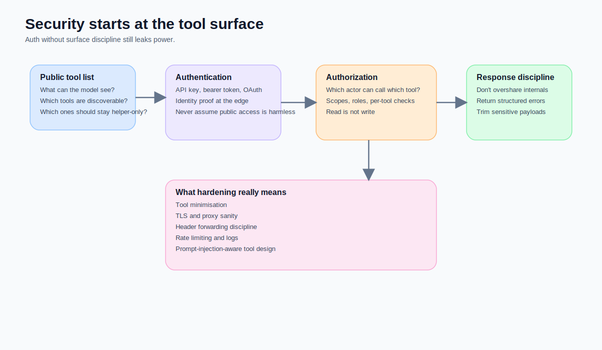
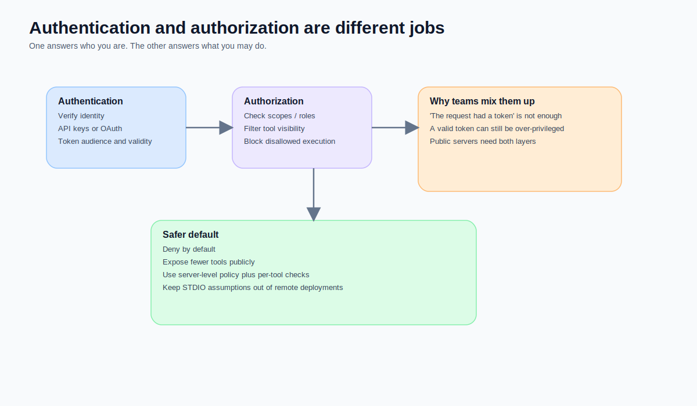
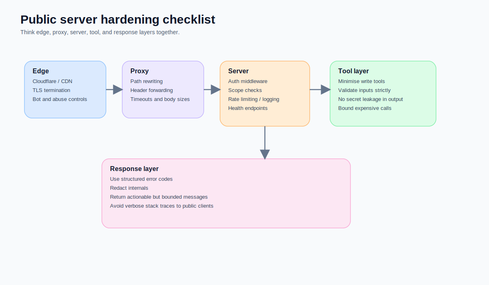
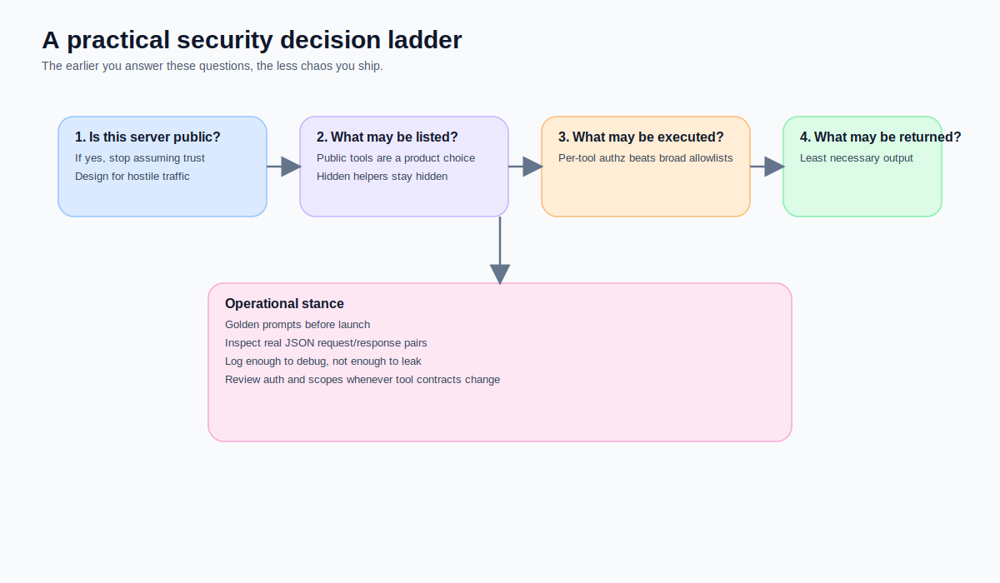

**Subtitle: If your MCP server is public, can write data, or touches real users, security cannot be the last middleware you add. It has to shape your tool surface, auth flow, authorization scope, and response discipline from the beginning.**

When teams first expose an MCP server to the public internet, the security checklist in their heads often looks like this:

- turn on HTTPS
- add an API key
- reject unauthenticated requests
- add rate limiting later
- revisit OAuth if needed

That sequence is understandable. It is also how many servers end up fragile.

Because the security problem of a public MCP server does not live in one layer.  
It lives in all of these at once:

- which tools the model is even allowed to see
- which tools are helpers and which ones deserve public exposure
- whether authentication proves identity
- whether authorization limits action
- whether your edge and proxy preserve your assumptions
- whether your error messages expose more internal structure than you intended

In other words, **security is not a patch. It is the boundary design of a public MCP server.**



## Start with the conclusion: for a public MCP server, “ship first, harden later” is the wrong rhythm

The official MCP security guidance does not frame security as a thin auth tutorial. It explicitly discusses prompt injection, confused deputy risks, token passthrough, tool safety, least privilege, and user consent. OpenAI’s ChatGPT developer mode documentation is equally blunt: developer mode offers full MCP client support, but it is powerful and dangerous, and developers need to account for prompt injection, model mistakes, and malicious MCP servers. FastMCP, meanwhile, has moved authentication, authorization, middleware, and component-level access control squarely into the production conversation.

Taken together, the message is clear:

> **A public MCP server is not secure just because it has auth. It is safer only when its visible surface, permissions, tool behavior, and response boundaries were designed deliberately.**

## Layer one: shrink the public surface before you add more controls

This is the easiest part to miss.

Teams often expose every callable function as a tool because they want the host to “see the full capability set”. But that instinct creates a practical problem:

> **Anything the model can discover is already part of your attack surface.**

If a capability only exists to glue server-side flows together, transform data, or resolve internal references, it does not automatically belong in the public tool list.

The more tools you expose:

- the more options the host has to consider
- the more chances the model has to pick the wrong one
- the larger your permission surface becomes
- the harder your authz policy gets to reason about

The MCP spec also reminds clients to treat tool annotations as untrusted unless they come from trusted servers. Push that lesson one step further and you get a practical rule: **do not design your public tool surface around hope.**

### My working rule
If a capability is any of the following, I usually hesitate to expose it publicly:

- a helper used only by server-side flows
- an ugly internal transform with poor standalone semantics
- a tool that needs too much hidden context to be safe
- a high-side-effect tool without mature authz boundaries
- a capability that is easy to misuse through prompt injection

A public tool list is not a feature checklist.  
It is closer to the minimum capability surface you are willing to let a model discover, reason about, and attempt to call.



## Layer two: authentication and authorization are different jobs

This is another classic trap.

Many projects say:

> We already have tokens.  
> So we should be fine.

That sentence only proves one thing: **you might know who is making the request.**  
It says nothing about **what they should be allowed to do.**

### Authentication answers:
- who is this requester?
- is the token valid?
- do issuer, audience, and expiry make sense?

### Authorization answers:
- may this actor list this tool?
- may they read this resource?
- may they execute this action?
- may they trigger writes, deletes, or costly operations?

FastMCP 3.x makes this distinction quite explicit. You can apply server-wide policy, component-level checks, and even filter list responses before execution happens. That matters because a healthy public server should not wait until execution time to reveal that a tool should never have been visible in the first place.

### A practical way to think about it
- **Authentication** decides whether someone gets through the door
- **Authorization** decides where they may go once inside
- **Tool surface design** decides how many doors you built in the first place

Lose any one of those layers and the system becomes brittle.

## Layer three: public server hardening is an end-to-end concern

Once you are on the public internet, security is no longer just an app-code issue.  
It becomes an end-to-end chain:

- DNS / CDN / edge
- TLS termination
- reverse proxy
- header forwarding
- origin app
- auth middleware
- tool execution
- response shaping

If any one of those layers violates your assumptions, the whole security model drifts.

### This is why I now think about hardening in five layers

#### 1. Edge layer
This covers:
- TLS
- first-line traffic controls
- bot / abuse filtering
- public endpoint health

#### 2. Proxy layer
This covers:
- whether `/mcp` paths survive intact
- whether Authorization headers reach origin
- timeout, buffering, and body-size behavior
- how upstream errors are rewritten or hidden

#### 3. Server layer
This covers:
- auth middleware
- scope and role checks
- request validation
- logging, tracing, and rate limits

#### 4. Tool layer
This covers:
- which tools are public
- which tools are read-only
- which tools have side effects
- which expensive or dangerous tools need stronger guardrails

#### 5. Response layer
This covers:
- whether clients can branch on structured errors
- whether stack traces or route names leak
- whether payloads include unnecessary sensitive fields
- whether responses are too verbose for public-facing use



## Prompt injection is closer to execution than many teams assume

This deserves its own section.

If the model can look at external content and then decide whether to call a tool, prompt injection is not just a “chat quality” problem.  
It can directly affect:

- tool choice
- privilege abuse
- accidental write operations
- the order in which sensitive resources are requested
- whether the model is manipulated into gathering more context than it should

The official MCP security guidance calls out these risks very directly. So if you run a public server, I would at least do the following:

- separate higher-risk write tools from read tools
- make dangerous tool schemas stricter
- avoid returning excessive detail that increases the attack surface of the next turn
- apply stronger authz to privileged tools instead of trusting the model to “do the right thing”

In other words, **tool safety cannot be outsourced to model goodwill.**

## The implementation order I trust more: shrink the surface, then permissions, then observability

If I had to compress the whole article into one engineering sequence, it would be this:

1. **Shrink the public surface first**  
   Do not expose every helper just because you can.

2. **Then separate authn from authz**  
   Authentication proves identity. Authorization constrains action.

3. **Then add observability and governance**  
   Logging, tracing, rate limits, golden prompts, and real-host testing.

That order is healthier than shipping first and hardening by patch.  
Because it accepts a simple fact:

> **Once an MCP server is public, it is no longer just a Python app. It is an execution boundary shaped by models, hosts, proxies, and users at the same time.**



## A minimal but healthier FastMCP direction

This is not meant as production copy-paste code. It is a shape worth thinking from:

```python
from fastmcp import FastMCP
from fastmcp.server.middleware import AuthMiddleware
from fastmcp.server.auth import require_scopes

mcp = FastMCP("Example Public Server")

mcp.add_middleware(
    AuthMiddleware(
        auth=lambda ctx: ctx.has_scope("mcp:read")
    )
)

@mcp.tool
@require_scopes("jobs:read")
def query_jobs(keyword: str, top_k: int = 10) -> dict:
    # strict validation + bounded response
    ...
```

The real point is not the decorator.  
The real point is that you have already thought through:

- which tools should exist at all
- which scope should be able to see them
- whether the response needs trimming
- which higher-risk actions deserve separate treatment

## The one line I most want to leave behind

A lot of teams think of public MCP security as:

> **How do I protect an MCP app?**

I think the better framing is:

> **How do I draw an execution boundary between a model and the outside world that does not collapse just because a request had a token?**

That boundary is what security, auth, and hardening are really for.
