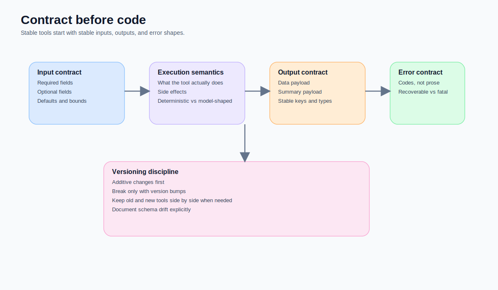
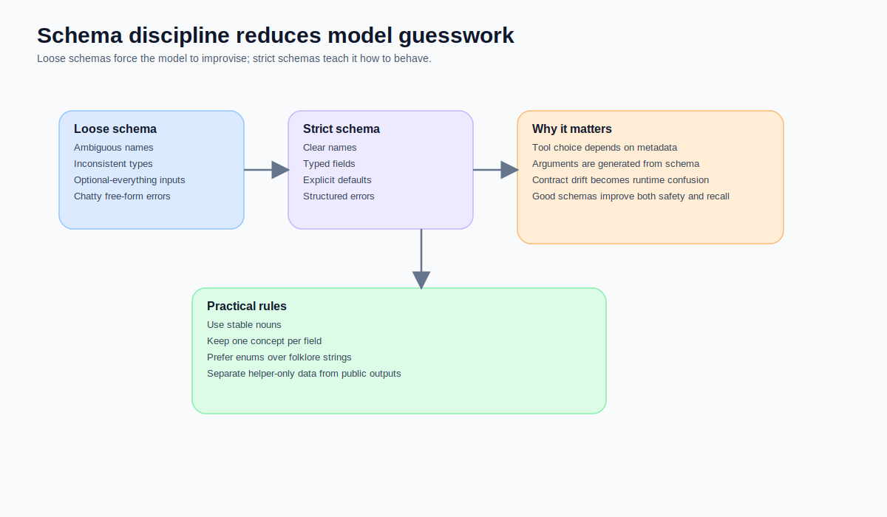
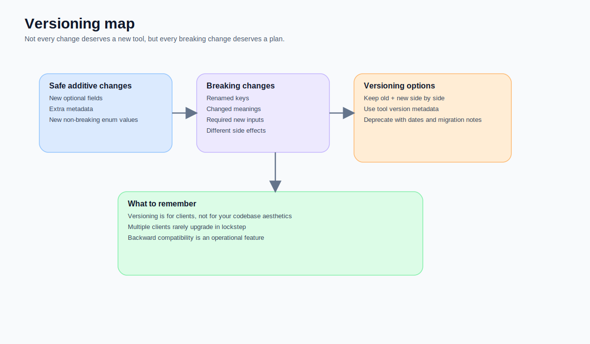
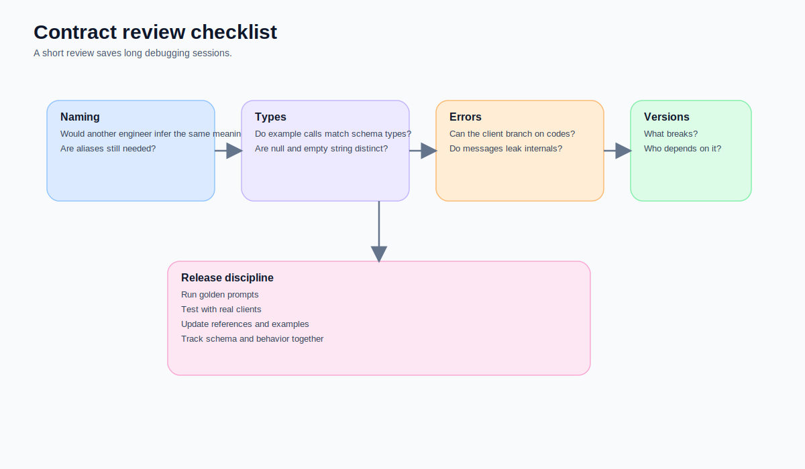

When teams first write MCP tools, most of the energy goes into one question:

> Does the feature work?

That question matters.  
But as soon as the system grows, harder questions show up:

- What does this input field actually mean?
- Is `null` the same thing as an empty string?
- Can a client branch reliably on this error?
- If I rename a field, change its meaning, or alter side effects, is that a breaking change?
- Is this a helper contract or a public contract?
- Which version will the host discover?
- If old clients upgrade slowly, do I need to serve two schemas in parallel?

None of those are code-style questions.  
They are **contract design** questions.

Once your server is used by multiple clients, hosts, or teams, what usually determines whether it can evolve safely is not the internal logic. It is this:

> **How stable is the tool contract?**



## Start with the conclusion: in MCP, schema is not documentation garnish, it is part of the execution boundary

The MCP specification treats the TypeScript schema as the source of truth for the protocol, with JSON Schema generated from it. That is a powerful clue. In this world, schema is not an after-the-fact explanation. It is part of interoperability itself. The same principle applies at the tool layer. Tool names, descriptions, input schemas, output shapes, and error structures all influence how hosts list capabilities, how models choose tools, how clients generate arguments, and how you safely evolve the system later.

So if you treat schema as something to tidy up later, you are not just building documentation debt.  
You are building **execution-boundary debt**.

## Layer one: a good contract does not mean “more fields”, it means “less ambiguity”

The first job of a tool is not to show how flexible it is.  
Its first job is to ensure nobody has to guess what you meant.

### What bad contracts often look like
- field names that are too vague, such as `type`, `data`, or `value`
- the same field meaning different things in different situations
- everything marked optional while hidden prerequisites still exist
- empty string, missing value, and `null` all mixed together
- all errors returned as prose
- internal helper fields leaking into public output

### What healthier contracts look like
- names that map clearly to one concept
- explicit required / optional boundaries
- side effects that can be described
- errors that can be branched on by machines
- stable return shapes that do not require prose to interpret

One thing that is easy to underestimate here is this:  
**the model is also a schema consumer.**

If the schema is loose, the model has to guess.  
If the schema is noisy, the model will fill in gaps in odd ways.  
If the schema is chatty, the host-side system becomes less stable.



## Layer two: schema discipline is not aesthetic, it is runtime risk reduction

Schema discipline can look like type-system perfectionism.  
I think it is a very practical reliability investment.

### Why?
Because MCP tools are not only called by engineers typing requests by hand.  
They are also:

- listed by hosts
- read by models as metadata
- invoked with model-generated arguments
- consumed by clients deciding what to do next
- composed by downstream toolchains

That means a loose schema does more than make code untidy.  
It creates runtime uncertainty:

- the model does not know which field matters most
- the client does not know whether an error is recoverable
- downstream systems do not know what they can safely depend on
- future maintainers cannot tell what counts as a breaking change

### The rules I trust more now

#### Rule 1: one field, one concept
If `job_id` is a job id, let it be a job id.  
Do not let it sometimes hold a URL, sometimes a fuzzy reference, and sometimes a human note.

#### Rule 2: if values are bounded, use enums instead of folklore strings
If a field really has a small set of allowed meanings, encode that explicitly instead of relying on convention.

#### Rule 3: do not smuggle helper-only data into public output
It can make the payload look rich in the short term, but it blurs what the public contract actually promises.

#### Rule 4: error codes must come before error prose
Natural-language error text is still useful.  
But the thing clients can rely on is the structured code and predictable fields.

## Layer three: versioning is not politeness, it is a survival skill in a multi-client world

As soon as your MCP server has:

- multiple hosts
- multiple clients
- beta and stable usage in parallel
- internal helpers and public tools living together
- different release cadences

versioning stops being a future concern and becomes a very present engineering problem:

> **If I change this tool today, who breaks?**

MCP itself uses date-based protocol versions to mark backward incompatible changes. That is instructive for tool design too. Not every change deserves a new tool name, but every breaking change deserves an explicit plan. FastMCP now supports component versioning, which means one codebase can serve multiple tool versions side by side.



### Changes that are usually safe and additive
- adding optional fields
- adding supplementary metadata
- introducing non-breaking enum values
- making output richer without changing the meaning of existing fields

### Changes that are usually breaking
- renaming fields
- changing field semantics
- turning optional inputs into required ones
- changing side effects
- changing the stable output shape that clients already depend on

### The versioning strategy I prefer
Not “rewrite everything whenever it feels cleaner”, but:

- keep additive changes on the existing tool
- serve breaking changes via a versioned tool or a parallel new tool
- provide a migration window
- update references, examples, and golden prompts together

That can feel like extra release work.  
In practice, it saves a lot of “why did this work yesterday but not today?” debugging.

## Layer four: contracts drift fastest when public tools and helper tools are mixed casually

This is a pitfall worth calling out.

When the same server contains:
- public tools
- internal helper tools
- orchestration-only transforms
- output-formatting helpers

contracts drift very easily.  
Internal assumptions start leaking into the public surface.

For example:
- internal trace fields appear in public output
- router-only parameters remain in the public schema
- public parameters follow internal naming habits
- outputs become awkward because they were shaped for server-side plumbing first

Over time, that creates a misleading situation:

> **You think you have many composable tools, but what you really have is a set of public tools leaking internal assumptions.**

So one of the most useful principles is simple:

**let public tools say only what public tools need to say.**  
Helper details should stay in the helper layer.

## A healthier contract review checklist

Whenever I add or change a tool, these are the questions I prefer to ask first:

1. Can I describe the tool’s core meaning in one sentence?
2. Would another engineer infer the same meaning from the field names?
3. Have I deliberately distinguished `null`, empty string, and missing values?
4. Can the client branch on error codes instead of prose alone?
5. Would this change break an older client?
6. Is this a public contract or a helper contract?
7. Do the examples, references, and golden prompts need to change too?



## A small but healthier FastMCP shape

This example is deliberately minimal, but it shows the direction I care about:
clear naming, bounded inputs, stable output, and branchable errors.

```python
from pydantic import BaseModel, Field
from fastmcp import FastMCP

mcp = FastMCP("Job Tools")

class QueryJobsInput(BaseModel):
    keyword: str = Field(..., description="Search keyword for job lookup")
    min_score: int | None = Field(default=None, ge=0, le=100)
    top_k: int = Field(default=10, ge=1, le=50)

@mcp.tool
def query_jobs(params: QueryJobsInput) -> dict:
    return {
        "status": "ok",
        "data": {
            "items": [],
            "count": 0
        },
        "error": None
    }
```

The key point is not Pydantic itself.  
The key point is that the tool is now explicit about:

- which fields are required
- what ranges are valid
- what the response shape looks like
- what a client may safely depend on

## The one line I most want to leave behind

In MCP, tools do not grow up just because they run.  
They mature when:

- their meaning is clear
- their schema is stable
- errors can be branched on
- versions can evolve
- public and helper boundaries stay clean

Which is another way of saying:

> **Whether tools can grow is usually decided less by code and more by contract discipline.**
