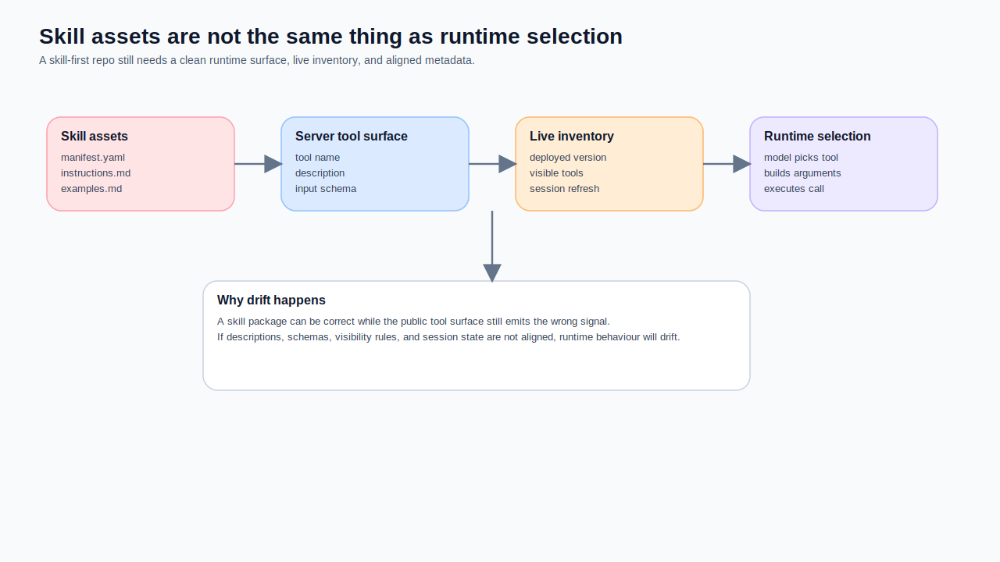
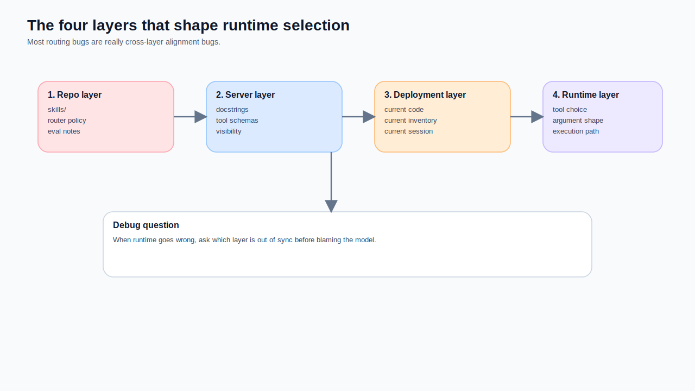
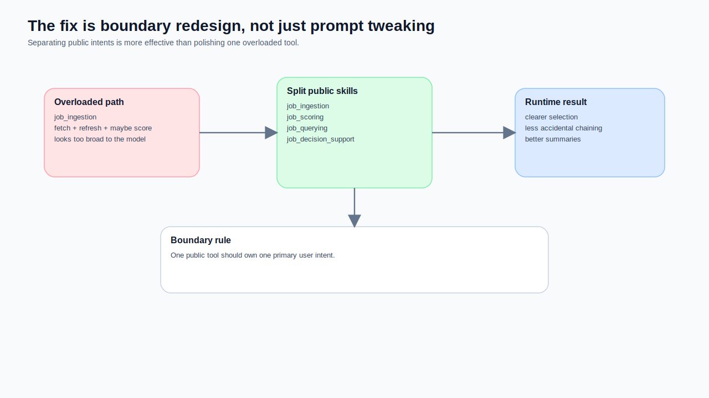
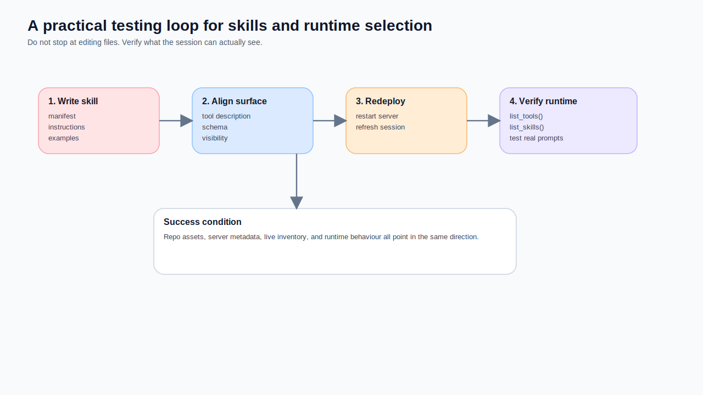

**Subtitle: Having skills in your repo does not mean the runtime will actually route by them. In practice, the model is far more influenced by the tool surface you expose, the live inventory a session can see, and whether your descriptions, schemas, and instructions line up.**

This is not another “skills are important” article.

What I want to write down is something much more operational:

> **Writing a skill package does not guarantee that the runtime will behave like a skill-first system.**

I learned that the hard way.

The request that exposed the gap was almost embarrassingly simple:

> Score all the jobs that still do not have a score.

What I expected was:
- route to `job_scoring`
- stay on a score-only path
- do not fetch fresh jobs again

What actually happened looked much closer to an ingestion path.
That was the moment I stopped treating skills, tool metadata, live inventory, and runtime tool selection as a single thing.



## The short version: a skill is an asset layer, not an automatic routing gate

FastMCP does provide skills utilities. You can discover, download, and sync skills, and it can identify skill resources using URIs such as `skill://{name}/SKILL.md`. That matters. But what it describes is **how skill assets are discovered and retrieved**, not “the model will definitely read those skills first and obey them”.

At the protocol level, the first-class object the model actually gets to invoke is still the **tool**. MCP’s tools spec is very plain about this: tools are exposed with a unique name and schema metadata. OpenAI’s tool design guidance is equally plain: **write concise, explicit descriptions, because the model chooses what to send based on your description**.

So the mental model I trust now looks like this:

- **skill**: strategy asset, boundary asset, operating documentation
- **tool**: the runtime capability surface the model actually sees
- **server instructions**: the server-level operating manual
- **provider / inventory**: what this specific session can list and call right now

If those four layers are not aligned, your system may look skill-first on disk while behaving quite differently at runtime.

## The problem only became clear after I split it into four layers

This is the debug map I use now.

### Layer 1: skill assets in the repo
This is the GitHub layer:
- `manifest.yaml`
- `instructions.md`
- `examples.md`
- `eval-notes.md`
- router policy / fallback policy

This layer matters because it captures your **design intent**.

### Layer 2: the tool surface actually exposed by the server
This is what the model really sees:
- tool name
- description / docstring
- input schema
- output shape
- which tools are listed at all

This is the interface the runtime touches every single turn.

### Layer 3: live deployment and session inventory
This is the layer many teams forget:
- did you actually deploy the new code
- did the inventory refresh
- is the client session seeing the latest version
- are you still effectively serving old metadata

### Layer 4: runtime tool selection
This is the final behaviour:
- which tools were listed
- which one looked most plausible for the request
- which schema seemed to fit the intent best
- whether server instructions actually helped



Once you separate those layers, a lot of “why is the model being stupid?” complaints turn into more useful engineering questions:

- was the skill boundary poorly written?
- or was the tool description sending the opposite signal?
- or was the session still stale?
- or were two tools simply too similar from the model’s point of view?

## In practice, the decisive signal is often not the document you wrote for humans

OpenAI’s guidance for tools contains one sentence I would happily pin to a wall:

> **Write concise, explicit tool descriptions. The model chooses what to send based on your description.**

That sounds like a writing tip. It is really a runtime systems tip.

If the model sees:
- a tool called `job_ingestion`
- a parameter called `force_rescore`
- and no clear description saying “this is not the score-only path”

then routing a backfill-scoring request into ingestion is not bizarre at all.

That is exactly why a skill file can be correct while the runtime still drifts.

### A surface that tends to mislead

```yaml
name: job_ingestion
input_schema:
  type: object
  properties:
    source_site:
      type: string
    days:
      type: integer
    page_from:
      type: integer
    page_to:
      type: integer
    force_rescore:
      type: boolean
```

From a model’s point of view, that looks like a very capable Swiss Army knife.

### A healthier separation

```yaml
name: job_scoring
public: true
allowed_backend_tools:
  - v2_tool_bulk_score_new_jobs
guardrails:
  - Do not fetch recent jobs in this skill.
  - Do not claim a fetch or refresh happened in this path.
```

That is essentially the spirit of the `job_scoring` manifest in your repo: **score-only really means score-only**. Once the manifest, server docstring, schema, and examples all say the same thing, runtime drift becomes much less likely.

## A deterministic policy on disk is still not the same thing as a live routing gate

Your `router/skill-selection-policy.md` is already doing an important piece of architectural work:
- choose exactly one public skill first
- prefer `job_decision_support` over `job_scoring`
- prefer `job_scoring` over `job_ingestion`
- keep `job_querying` as the broad read-oriented path
- avoid automatic multi-skill chaining in v1

That is valuable because it defines how the system **should think**.

But I want to be very direct here:

> **Having that document does not mean the live runtime is enforcing it.**

Why not?
Because:
- the policy file is design intent
- runtime selection is the model reacting to the current visible tool surface

Unless you actually turn that policy into one or more of the following:
- visibility rules
- deterministic gating before exposure
- tool subsets through `allowed_tools`
- server-side filtering of which backend tools are reachable

then the policy remains closer to architecture guidance than an active traffic light.

## The real fix is usually not more prompt text. It is a cleaner capability boundary

This is the lesson I trust most now.

If a request keeps drifting into the wrong tool, do not start by blaming the model. Start by asking:

1. **Are two tools too similar from the model’s perspective?**
2. **Did we leak low-level capability into the public surface?**
3. **Are the manifest, description, schema, and examples out of sync?**

### The design moves that helped most

#### Move 1: one public tool, one primary intent
- `job_ingestion` handles refresh / fetch
- `job_scoring` handles score-only / backfill
- `job_querying` handles shortlist / filter / rank
- `job_decision_support` handles deep output for one job

#### Move 2: internal helpers should stay internal
A helper like `resolve_job_reference` can be critical without belonging on the public tool surface.

#### Move 3: change the manifest, docstring, schema, and examples together
If you only update one layer, the system still behaves like an instrument with one string out of tune.



## A more practical development loop

If you want a skill-based MCP server to behave like one in production, this is the workflow I now recommend.

### Step 1: write the skill manifest before the server docstring
Be explicit about:
- the public skill name
- the user intent it owns
- the backend tools it may call
- what it must not do
- which missing context should fail hard

### Step 2: align the server tool surface with that manifest
- the tool name should match the boundary
- the description should say what it does and does not do
- the schema should not keep ambiguous “maybe useful” parameters
- hidden helpers should remain hidden

### Step 3: restart the server and reconnect the client
Do not assume the session is automatically seeing your new inventory.

### Step 4: verify the inventory with a minimal client
I strongly recommend checking `list_tools()` and `list_skills()` before asking ChatGPT to act as an oracle.

```python
from fastmcp import Client
from fastmcp.utilities.skills import list_skills

async with Client("https://your-server.example.com/mcp") as client:
    tools = await client.list_tools()
    skills = await list_skills(client)
    print([t.name for t in tools])
    print([s.name for s in skills])
```

### Step 5: only then test natural language requests
And do not only test the happy path.

Test at least:
- score backfill
- refresh + score
- shortlist query
- single-job deep analysis
- mixed-intent requests

## Server instructions are worth using, but not worth worshipping

The MCP maintainers have published a very good note on **server instructions**. I agree with the premise: server instructions are a kind of user manual for the model, and they can materially improve tool use.

But I would add one sentence of caution:

> **Server instructions help, but they do not replace a clean tool surface.**

I treat them as:
- a navigation layer above skills
- a place to capture selection heuristics and prohibitions
- a way to explain the operating style of the server

not as a magic patch for messy public tools.

## The checklist I keep now

Before I re-test routing after changing skills or server metadata, I run this list:

- does this request map to exactly one public tool?
- is the repo manifest aligned with the docstring?
- does the schema leak any misleading parameter?
- are internal helpers actually hidden?
- do the server instructions include the most important operating hints?
- was the live deployment restarted?
- was the client session refreshed?
- do `list_tools()` and `list_skills()` show the inventory I think I shipped?



## The final sentence

The sentence I trust least now is this one:

> The skill is written, so the model should know what to do.

No. At best, that means your **strategy assets** are in better shape.

Actual runtime behaviour still depends on:
- what the public tool surface looks like
- what inventory the current session can see
- what server instructions say
- which version the host has really loaded

If you want a skill-first MCP server to behave like one, do not stop at writing skills. Treat **manifest design, docstrings, schemas, visibility rules, session refresh, and runtime tests** as one engineering job.
