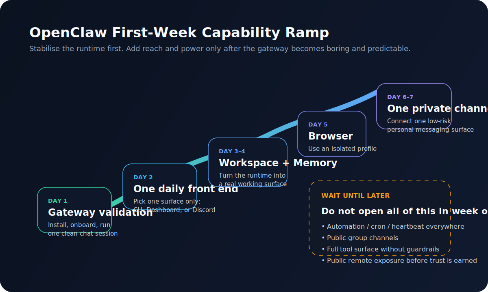

> 適合誰：你已經把 OpenClaw 裝起來了，主線是 macOS / Mac mini + Codex OAuth，現在想知道第一週到底該怎麼用，而不是看一張功能總表再自己亂猜。  
> 這篇故意不教你所有進階功能。我要做的，是把**第一週最值得打開的能力順序**排出來，讓你從「安裝成功」走到「開始形成自己的工作節奏」。

---

## 先講結論：第一週不要追求功能數量，要追求手感變得穩定

我現在回頭看，OpenClaw 新手第一週最容易犯的錯，不是某條指令打錯，而是**太早把整座遊樂園打開**。

一開始很容易手癢：

- 想接 Discord
- 想測 Browser
- 想裝一堆 Skills
- 想開 heartbeat
- 想把它放到遠端
- 想讓它像真的個人助理一樣全天候待命

然後事情就會像把龍蝦、控制台、瀏覽器、電鋸和 Discord invite link 全丟進同一鍋，聲勢很大，判斷卻很混。

所以這篇的核心主張很簡單：

> **OpenClaw 第一週最重要的，不是把功能開滿，而是建立一條正確的啟用順序。**

你要先讓它變成一套你能觀察、能修正、能預測的系統。  
只要還沒到這一步，後面加上的每個能力，都只是把除錯半徑一起放大。

---

## 我現在會怎麼帶第一週：先本機、再習慣、再能力、最後才是自動化

用一句話講，第一週的順序應該是：

1. **先確認 Gateway 活著**
2. **再選一個你每天會用的前端**
3. **再把 workspace 與 memory 變成真的工作場**
4. **再打開 Browser**
5. **再接一個私有 channel**
6. **自動化、heartbeat、cron 先不要急**

這個順序不是理論上的漂亮排序，而是我現在會真的拿來帶人的順序。  
因為 OpenClaw 的很多問題，不是裝不起來，而是你太快進入一個自己還不會治理的狀態。



---

## 為什麼第一週的順序比功能清單重要

官方 Getting Started 說得很清楚，OpenClaw 的起點其實很樸素：安裝、跑 onboarding、拿到一個可運作的 Gateway、完成一次聊天。官方的 Gateway runbook 也明確把 day-1 startup 和 day-2 operations 分開。換句話說，OpenClaw 從一開始就不是在鼓勵你把所有能力一次打開，而是要你先把 runtime 站穩。  
這對新手很重要，因為你後面接 Browser、Channels、Memory、甚至自動化，全部都還是繞回同一個 Gateway。第一週如果沒把這顆核心顧好，之後每個 symptom 都會像長在別的器官上。 

我自己的版本會再保守半格。  
因為 Daniel 這條主線不是「今天先搭一個酷炫 demo」，而是「把 OpenClaw 真的放進自己的工作流，讓它在 Mac mini 上長期待命」。這種路線最怕的不是少一個功能，而是整套行為很不 boring。

---

## Day 1：先確認不是假成功

如果你剛完成安裝，我最推薦第一天只做這幾件事：

```bash
openclaw status
openclaw models status
openclaw doctor
openclaw gateway status
openclaw dashboard
```

這組動作看起來沒有戲劇張力，但它非常重要。  
因為你要先知道：

- Gateway 到底有沒有真的在跑
- 模型與認證到底是不是通的
- doctor 有沒有直接指出結構性問題
- Dashboard 能不能正常連上
- 你的狀態不是「只有上一次那個 terminal 視窗剛好還沒關掉」

### 我會把第一天的成功定義成這樣
- 你知道 Gateway 是 source of truth，不是某個前端視窗
- 你知道 Dashboard 連不上時先看哪幾個指令
- 你知道 `openclaw status`、`openclaw models status`、`openclaw doctor` 各自在看什麼
- 你已經做過一次本機聊天，不是只有看 onboarding 成功畫面

如果第一天這些還沒穩，就先不要往後面衝。

---

## Day 2：選一個你真的會每天打開的前端

很多新手會同時開：

- TUI
- Dashboard
- Discord
- 手機
- 可能還有 Browser

結果什麼都摸到一點，卻沒有一條真正每天會走的工作路線。

我現在會建議，**第二天只選一個主要前端**。  
對 Daniel 這條主線來說，我會偏向：

- **主前端：Dashboard**
- **輔助前端：TUI**

理由很簡單。  
Dashboard 很適合做狀態觀察、session 感、日常互動。  
TUI 則很適合你在 host 上做較工程味的查驗與短互動。

### 第二天不要做的事
- 不要把 Discord 當主要工作前端
- 不要一開始就把手機遠端操作當成主體
- 不要同時訓練自己用四個入口

因為你現在要建立的，不是功能熟悉度，而是**一條穩定的日常使用手勢**。

### 我通常會做一個很小的固定測試
例如：

1. 在 Dashboard 問一個需要讀 workspace 的小任務  
2. 看它的回應與工具行為  
3. 如果答歪，直接補 instruction  
4. 再開新 session 重試一次  

這件事很小，卻很重要。  
因為你會開始有一種感覺：OpenClaw 不是拿來「問天」，而是拿來**持續調整工作邊界**。

---

## Day 3：把 workspace 當成工作場，不要只把它當設定檔資料夾

官方 Personal Assistant Setup 和 Memory Overview 都很明確：OpenClaw 的工作記憶、操作說明、人格設定，本質上都落在 agent workspace。  
對我來說，這代表第三天最該做的不是裝更多東西，而是開始對 workspace 有感。

至少先理解這幾個檔案的角色：

- `AGENTS.md`
- `SOUL.md`
- `TOOLS.md`
- `MEMORY.md`
- `memory/YYYY-MM-DD.md`

### 第三天要做的事，不是寫一篇小說給它看
我會先從很小的東西開始，例如：

- 你的主要用途是什麼
- 你的禁區是什麼
- 哪些 repo / 路徑是常用工作區
- 你希望它怎麼回報結果
- 哪些內容應該寫進 durable memory，哪些只是今天的上下文

這時候 `MEMORY.md` 很像龍蝦的長期腦袋，  
`memory/YYYY-MM-DD.md` 比較像牠今天的筆記本。

### 一個很實用的原則
**不要把所有聊天內容都想丟進記憶。**

真正值得寫進 `MEMORY.md` 的，通常是：

- 穩定偏好
- 長期工作背景
- 固定環境
- 常用 repo / host / 路徑
- 不該碰的紅線

不值得寫進去的，通常是：

- 今天臨時要查的某件事
- 一次性的腦暴材料
- 還沒驗證的重要結論
- 你只是今天心血來潮的一個小要求

第三天的目標不是讓它記很多，而是讓你開始知道**什麼東西值得被它長期記得**。

---

## Day 4：開始養成 session hygiene，不然你會很快把 context 養成一團毛球

這一步很多人太晚學。  
但對我來說，OpenClaw 真正從「好像會動」進入「開始像系統」，就是你開始有 session discipline 的那一刻。

官方文件已經把這些基礎做得很清楚：

- `/new` 或 `/reset` 可以開新 session
- `/compact` 可以做 compaction，保留重要上下文、收斂 token 成本
- transcript 和 memory 不是同一件事

### 我第一週只要求自己養成兩個習慣
1. **一條主題結束，就開新 session**  
2. **覺得上下文開始變腫，就主動 compact**

這很像整理桌面。  
你不是每天都大掃除，但你也不能讓所有工具、紙張、電線一直長在桌上。

### 這一步的價值
你會開始感覺到：

- 哪些任務適合放在同一條 session
- 哪些任務只是硬擠在一起
- 哪些東西應該進 memory
- 哪些只是 transcript 裡的歷史灰塵

這一層一旦養起來，後面 Browser、Discord、background tasks 才比較不會把 context 一路養成海帶糾纏。

---

## Day 5：只在真的需要時打開 Browser，而且先用 openclaw profile

官方 Browser 文件對這條邊界講得很清楚：

- `openclaw` profile 是 agent-only browser
- 它不碰你的個人 browser profile
- `user` profile 會去 attach 你的真實 Chrome session
- 需要登入的站點，官方建議是**手動登入**
- 不要把帳密直接交給模型

這幾句看起來像常識，但對第一週非常關鍵。

### 我現在對 Browser 的建議很明確
**先把 Browser 當成 research lane，不要當成你個人帳號的萬用遙控器。**

第一週你可以拿它做的事情：

- 打開文件頁
- 看公開網頁
- 做資料整理
- 截圖、摘要、逐頁讀取
- 操作低風險站點

第一週我不建議你立刻做的事情：

- 直接把主要個人帳號綁進 `user` profile
- 把 Browser 當成登入型工作的大本營
- 以為有 Browser 就等於有整台電腦控制權
- 拿它去試一堆反 bot 很重的站點

### 為什麼我會這麼保守
因為 Browser 一旦打開，你的感受會瞬間變得很炫。  
但炫不是穩。  
第一週的目標是把它變成**可預測的研究工具**，不是炫技開關。

如果 `openclaw browser status` 還沒穩，或者你對 profile 邊界還沒有感，就先不要碰 `user` profile。

---

## Day 6 到 Day 7：再接一個私有 channel，而且先用 DM 模式

等你已經能在本機穩定用，Browser 也有基本手感，這時候才輪到私有 channel。

這一步我會建議你優先用：

- **Discord DM**
- 或 **Telegram**

而不是一開始就把它丟進多人 server 或公開群組。

### 為什麼
因為 channel 會把原本只在本機的問題，全部變成「外部輸入 + auth + routing + policy」的組合題。

官方 Discord 文件與 channels troubleshooting 其實已經把幾個重點講得很直白：

- 先用自己的 private server / 私有場域
- pairing 與 allowlist 不是同一件事
- `requireMention` 也不是整套 group access control
- `channels status --probe` 很適合拿來看 channel 健康與權限問題

### 第七天的好策略
- 先只開 DM
- 讓 pairing 跑通
- 確認 allowlist / sender policy 沒歪
- 只允許少量已知使用者
- 不要一開始就讓整個多人群組都能喊它

這一步做對了，你會第一次真的感覺到：  
**OpenClaw 開始從一台本機工具，變成一個你可以從別的表面叫醒的常駐代理。**

---

## 第一週真的先不要碰的東西

這裡我想直接講得硬一點，因為我自己現在就是這樣看。

### 1. 不要太早開 heartbeat
官方 Personal Assistant Setup 提醒得很清楚，heartbeat 是真的 agent turn，間隔越短越燒 token。  
如果你連前面的日常使用手感都還沒建立，heartbeat 只會把噪音變成定時噪音。

### 2. 不要太早開 cron
cron 很值得用，但它是排程器，不是新手玩具。  
在你還不知道 session、delivery、通知策略怎麼設計之前，先不要急著讓龍蝦每天自己跑出去巡邏。

### 3. 不要看到東西被擋，就直接把 `tools.profile` 切成 `full`
這幾乎是第一週最典型的暴衝行為。  
你現在真正需要的是理解**哪一層在擋你**，不是把所有門一起踹開。

### 4. 不要先走公開遠端路線
Control UI 文件和 Security 文件都在提醒同一件事：  
本機 loopback 和遠端暴露不是同一個風險等級。  
第一週你只要先知道 `127.0.0.1` 是舒服的起點就好。  
SSH tunnel、Tailscale、公開反向代理，先留到後面。

### 5. 不要一開始就把第三方 skills 裝成技能大賣場
Skills 很有用，但它們會進 prompt，也有供應鏈風險。  
第一週最好的技能策略，不是「裝滿」，而是「少量、必要、看得懂」。

---

## 一個我現在很相信的第一週節奏表

如果要把它壓成更具體的節奏，我會這樣安排：

| 時間 | 目標 | 只做什麼 | 不做什麼 |
|---|---|---|---|
| Day 1 | 確認 Gateway 活著 | `status`、`models status`、`doctor`、Dashboard、本機聊天 | 不接外部 channel |
| Day 2 | 建立主前端習慣 | Dashboard / TUI 二擇一為主 | 不同時練四個入口 |
| Day 3 | 讓 workspace 有感 | `AGENTS.md`、`SOUL.md`、`MEMORY.md` | 不把一切都寫成長期記憶 |
| Day 4 | 建立 session hygiene | `/new`、`/compact`、分主題工作 | 不把所有任務擠在同一條 session |
| Day 5 | 打開 Browser | `openclaw` profile、公開或低風險研究頁面 | 不先 attach 個人登入 profile |
| Day 6-7 | 接一個私有 channel | Discord DM 或 Telegram、pairing、allowlist | 不先上多人群組或公開面 |

這張表最重要的精神不是「第幾天一定做哪個」，而是：

> **每往外擴一層，都要先確定前一層已經夠 boring。**

---

## 什麼叫做「第一週成功」

對我來說，第一週成功不是你已經把 OpenClaw 變成鋼鐵管家。  
而是你做到下面這些：

- 你知道 Gateway 才是 source of truth
- 你有一個每天真的會用的主前端
- 你知道 workspace 不是神祕黑盒，而是可管理的工作區
- 你開始分得清 transcript 和 memory
- 你知道 Browser 應該先放在什麼風險等級
- 你已經從一個私有 channel 成功叫醒它
- 你沒有急著把整台系統變成權限過大的怪獸

這時候，OpenClaw 才算真的從「安裝完成」進入「開始上工」。

---

## 最後一句：第一週不要追求像產品 demo，要追求像一台你會信任的機器

我現在對 OpenClaw 第一週的判準其實很簡單：

> **不是看它能不能做很多事，而是看你敢不敢讓它明天繼續待在那裡。**

如果你今天的設定讓你明天不太想再碰它，那代表不是它不夠強，而是你開得太快。  
先把第一週走成一條有秩序的坡道，後面 Skills、遠端、Automation、多 Agent 才不會像突然長出來的觸手。

---

