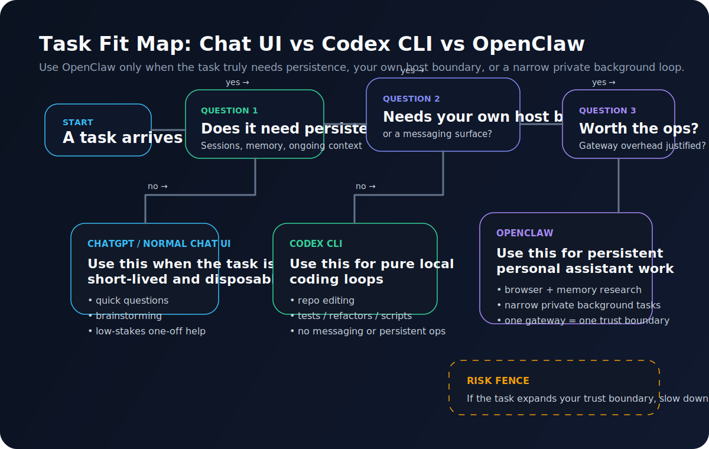

> Audience: you already understand that OpenClaw is a self-hosted agent gateway, and now you want the more honest question answered: **what jobs should it actually own?**  
> This is not a product tour. It is a judgment piece. The goal is to separate OpenClaw’s sweet spot from the shiny tasks that are not worth the operational weight.

---

## My core view

If you only look at the feature list, OpenClaw can trigger a very natural misunderstanding.

It can:
- connect channels
- drive a browser
- read and write files
- store memory
- run background work
- stay online on your own host

And your brain fills in the rest:

> So should every agent-shaped task go through OpenClaw?

My answer is no.

I would say it more strongly than that:

> **OpenClaw is worth using when a job genuinely needs a persistent gateway, your own trust boundary, your own workspace, and your own channel surfaces.**

If the task does not need those things, you are often just adding operational overhead for style points.

---

## The three questions I use

When I decide whether a task belongs in OpenClaw, I ask three questions.

### Question 1: does this task need to persist?
In other words:
- does it need continuity across sessions?
- does it need to be reachable from different surfaces?
- does it need to leave a trail in the same workspace?
- is it more than a one-off interaction?

If the answer is no, it may not be an OpenClaw job at all.

### Question 2: does it need my own host, tools, or channels?
OpenClaw’s real value is not that the model becomes more magical.  
It is that the model sits inside a runtime you control.

So I ask:
- does this need to live in my files, my workspace, or my chat surface?
- does it need the same memory and the same guardrails over time?
- do I need it to be reachable from Discord, Telegram, or the dashboard as the same agent?

If the answer is still no, the task usually does not need this layer.

### Question 3: is the governance cost worth it?
This is the most important question, and the easiest one to skip.

The moment OpenClaw enters the picture, you also inherit:
- auth
- tool policy
- channel access control
- logs
- transcripts
- memory
- recovery
- security footguns

If the value of the task is not worth that bundle, then it should not be an OpenClaw job.

---

## Where OpenClaw really shines

For me, the sweet spot clusters around four categories.

---

## 1. Cross-surface personal assistant work with continuity

This is the most natural fit.

For example:
- I start something in the dashboard
- I follow up later from Discord DM
- the same agent still has the same working background
- it can read the same workspace, memory, and operating instructions

Normal chat tools can help with parts of that, but they do not feel native there.  
OpenClaw does.

### Good examples
- daily work triage
- follow-up reminders
- long-running side project notes
- private knowledge review
- recurring personal operations that need continuity

The key requirement here is not raw model power.  
It is persistence.

---

## 2. Research workflows that combine browser and memory

This is one of the strongest reasons to use OpenClaw at all.

If all you need is a quick answer, ChatGPT may already be enough.  
But if your rhythm looks more like this:

1. search or collect
2. open pages
3. extract what matters
4. save the useful part into memory
5. come back later from another surface and continue

then OpenClaw starts behaving like a real research runtime rather than a single chat box.

### But the boundary matters
I am talking about:
- public or low-risk pages
- research that benefits from continuity
- information you want to revisit later

I am **not** talking about:
- giving every personal account to the browser
- fragile sign-in-heavy automation
- treating every site like a carefree automation playground

The browser docs draw this line clearly. The `openclaw` profile and the `user` profile are different roads, and login is supposed to be manual when needed. So yes, the browser is useful, but mostly because it supports structured web interaction inside a wider workflow.

---

## 3. Private-channel triage and follow-up work

I like this category because it uses two of OpenClaw’s best traits at the same time:
- a persistent gateway
- a messaging surface

For example:
- you DM it a thought in Discord
- it turns that into a next-step list
- it checks the workspace and existing memory
- you continue later from the local dashboard

A normal chat UI can still be useful here, but OpenClaw makes the continuity feel much more natural.

### The conditions
- private DM or a very controlled group
- pairing, allowlisting, and mention-gating are set deliberately
- you still treat it as a one-boundary personal assistant, not as a public shared bot

Without those conditions, the governance story collapses quickly.

---

## 4. Narrow background tasks after the baseline is trusted

I am intentionally saying **after** the baseline is trusted.

The moment you enable heartbeat, cron, or hooks, OpenClaw starts shifting from “assistant I wake up” to “agent that moves on its own”. That is powerful, but it is also where you need more discipline.

The background jobs I think are genuinely worth it tend to look like this:
- one daily personal summary
- checking one low-risk source on a schedule
- writing structured output back into the workspace
- delivering results to one private surface you control

The common trait is:
> **small scope, narrow permissions, predictable output.**

If your task description is something like “have it keep an eye on important stuff for me every day”, that is usually too vague. Vague background agents are great at burning tokens and creating surprises.

---

## What should usually stay out of OpenClaw

This part matters even more than the sweet spot.

The real time saver is not shoving more things into OpenClaw.  
It is knowing what should stay elsewhere.

---

## 1. Pure coding help when you are already sitting in the repo

This is the classic counterexample.

If your loop is:
- read code
- edit files
- run tests
- iterate quickly
- all on the same local machine

then I would usually say: **start with Codex CLI.**

That is not because OpenClaw cannot do it.  
It is because the real requirement there is:
- a fast local loop
- low-friction file and command access
- no need to carry a full gateway, channel, memory, and routing model

Codex CLI is built precisely for that local terminal workflow.  
If you are mostly doing high-frequency repo work, adding the whole OpenClaw runtime first is often more roundabout, not more advanced.

### When coding work moves closer to OpenClaw
It starts making more sense when coding is only one part of a wider system:
- remote wake-up from a channel
- memory and workspace rules across sessions
- a persistent personal assistant, not just a local coding tool

---

## 2. One-off chat, drafting, lookup, and polishing

I do not force these into OpenClaw either.

A lot of tasks really only need:
- one answer
- one draft
- one comparison
- one temporary burst of help

That is exactly where ordinary chat tools shine.

### My simple rule
If I do not want the task to leave behind tool authority, channels, or durable context, then most of the time it should not go into OpenClaw.

---

## 3. Public groups or shared multi-user surfaces with tool authority

I would treat this as a high-risk bad idea.

The security docs are quite clear on the central posture:
- one gateway should map to one trust boundary
- it is not meant to be a shared multi-tenant boundary for mutually untrusted users
- if multiple untrusted users can talk to the same tool-enabled agent, they are effectively sharing the same delegated authority

In plain terms:

> **If you would not treat those people as one authority boundary, do not let them all command the same tool-enabled agent.**

So:
- public groups
- large shared servers
- loose trigger conditions
- and an agent that can run commands, use the browser, or touch files

That is not a “fun experiment” default.  
That is an accident queue.

---

## 4. Login-heavy automation on sensitive or fragile sites

The browser is enticing, but login automation is where people drift into fantasy very quickly.

The Browser Login docs are explicit:
- sign in manually when needed
- do not hand credentials to the model
- automated logins can trigger anti-bot defences and even lock accounts

So if a workflow depends on:
- your primary personal account
- a fragile site
- high account risk
- low tolerance for mistakes

then the browser is not forbidden, but your risk posture should be extremely conservative.

---

## 5. Any setup where you do not actually want to operate a persistent service

This is a quieter truth, but an important one.

Some people are fully capable of installing OpenClaw.  
They just do not want to think about:
- service lifecycle
- tokens
- logs
- doctor
- channel health
- pairing
- allowlists
- backup and recovery

That is not a personal failing.  
It just means another tool shape may fit better:
- ChatGPT
- the Codex app
- Codex CLI
- or another more temporary, lower-governance tool

OpenClaw is not only a capability bundle.  
It is also an operations bundle.

---

## A simple classification I keep coming back to

I tend to divide tasks into three buckets:

| Category | Typical example | Judgment |
|---|---|---|
| **Strong OpenClaw fit** | private channel assistant, research workflow, continuity-heavy personal ops, narrow background jobs | yes |
| **Conditional fit** | coding plus messaging, browser-assisted ops, small automation | only after permissions and governance are tight |
| **Usually a poor fit** | one-off chat, pure local coding loop, shared public group agent, risky login automation | keep it out |

The real value in this table is not the rows.  
It is the distinction behind them:

- jobs that need a runtime
- jobs that only need a model
- jobs that only need a narrower tool

---

## One useful counterexample

I want to include one counterexample, because otherwise the article risks becoming a slogan.

Sometimes people say: “But my work is long-running too.”

For example:
- I work in the same repo every day
- I do need continuity
- I am on the same local machine most of the time

That sounds like OpenClaw at first glance.

But if the actual task does **not** need:
- channels
- remote wake-up
- a persistent gateway
- workspace memory across different surfaces
- browser, routing, or messaging

then it still looks more like a **Codex CLI job** than an OpenClaw job.

So the correction is:

> **Long-running does not automatically mean gateway-shaped.**

The real question is whether the extra runtime layer creates meaningful value.

---

## My final test

The sentence I use most often now is this:

> **If the task loses little value when you remove the persistent gateway, the workspace, and the channel surface, then it probably does not belong in OpenClaw.**

That is not a universal law.  
But for Daniel’s path, it is a very good working rule.

Because what we want is:
- a lobster that stays on our own turf
- one agent we can wake from different surfaces
- continuity across real work
- access to our own workspace
- more capability only after governance is clear

What we do **not** want is:
- shoving everything into it
- carrying a full runtime where a narrower tool would do
- making OpenClaw hold more authority than the task deserves

---

## Final thought

The most mature way to use OpenClaw is often not “use it for everything”.

It is this:

> **Know what becomes more valuable inside a persistent gateway, and let the rest stay with narrower tools.**

That kind of restraint is worth more than memorising the whole feature menu.  
It is what makes OpenClaw feel like a runtime you can actually live with.

---

