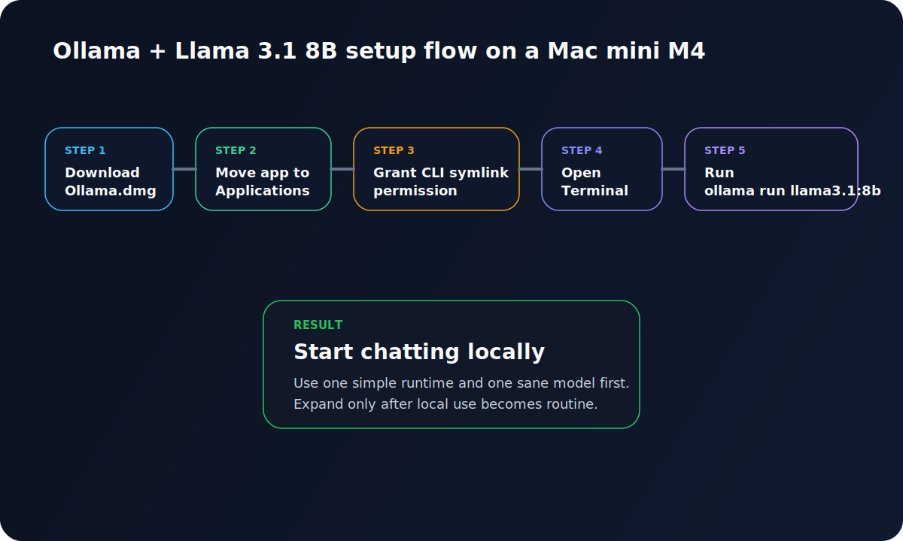
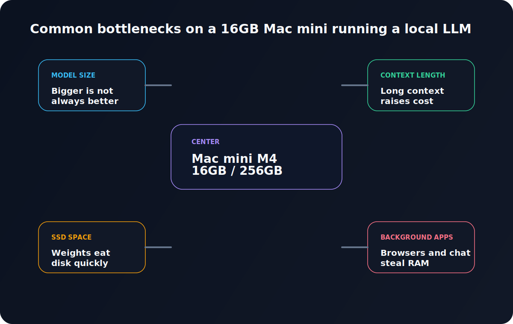

If you have a **Mac mini M4 with 16GB of unified memory and a 256GB SSD**, the first problem with local models is rarely installation. It is choosing a sensible starting point.

There are too many model names, too many half-true recommendations, and too many discussions that confuse “can be made to run” with “pleasant enough to use every day”.

I did not want to start by benchmarking ten different models or building an elaborate local AI stack before I had even proved I would use it. What I wanted was simpler: a setup that would run on this machine without turning the whole thing into treacle.

This is the setup I would recommend as a first serious starting point for that hardware:

- **Runtime**: Ollama  
- **Model**: Llama 3.1 8B  
- **Best for**: general chat, summaries, translation, light drafting, modest coding help  
- **Not aiming for**: very large models, huge context windows, elaborate agent tooling

It is not the only sensible choice, but it is a very practical one.



## The judgement call that matters

On a **16GB Apple Silicon Mac**, the useful question is not merely whether a model can run.

It is this:

> **Can it run comfortably enough that you will still want to use it after the novelty wears off?**

That sounds obvious, but it is where a lot of local-LLM advice goes sideways.

People often talk as if the decision were binary. Either the model runs or it does not. In practice, there is a broad swamp in the middle: models that technically load, but are awkward enough that you quietly stop opening them.

That is why my working rule for this machine is pretty plain:

1. **Start with small to mid-sized models**, not 24B, 32B, or 70B fantasies.  
2. **Start with the least fussy runtime**, not the most theoretically elegant stack.  
3. **Start with one broadly useful instruct model**, and only branch out once local use has become part of your actual routine.

By that standard, **Ollama + Llama 3.1 8B** makes a lot of sense.

## Why Ollama first, rather than LM Studio or MLX?

This is not really a ranking. It is more about choosing the easiest front door.

### Why I would start with Ollama

Ollama removes a surprising amount of friction. You install the app, open a terminal, and run:

```bash
ollama run llama3.1:8b
```

That command downloads the model and launches an interactive session. For a first local setup, that directness matters.

It also supports Apple Silicon cleanly, with Metal already built in. If you later want to wire it into editors, local UIs, or other tools, you have a local API ready to go.

### What about LM Studio and MLX?

They are both valid. They just solve slightly different problems.

- **LM Studio** is excellent if you prefer a GUI and want model browsing to feel more visual.
- **MLX / MLX LM** is more of a deeper Apple Silicon toolchain. It becomes interesting when you want to think about quantisation, fine-tuning, or lower-level experimentation.

I was tempted by the usual “MLX is faster” line as well. After digging through it all, though, I landed on a more boring conclusion: for most newcomers, **getting a local model into daily use matters more than chasing the last bit of theoretical efficiency**.

## Why Llama 3.1 8B?

Because it sits in a very useful middle ground.

The Llama 3.1 family on Ollama comes in **8B, 70B, and 405B** sizes. On this machine, 70B and 405B are not serious starting points. The one that matters is **8B**. Ollama lists `llama3.1:8b` at roughly **4.9GB**, which is large enough to feel capable and still modest enough to be realistic on a 16GB Mac.

That makes it a sensible first local model for:

- everyday question answering
- drafting and rewriting
- summarisation
- translation
- light programming assistance

It is not a miracle worker, but it does cover a wide range of ordinary tasks rather well.

### Why not go smaller and use a 3B model?

You could, especially if responsiveness matters more than quality.

But I would not make a 3B model the default recommendation. Smaller models often look fine in short demos, then start to feel cramped once you ask them to do longer rewrites, more structured summaries, or several rounds of iteration.

If your machine can handle 8B comfortably enough, 8B is a better long-term starting point.

### Why not jump to 24B or beyond?

Because **16GB of unified memory** is not the right place to start collecting oversized models.

One of the recurring sources of confusion in local-LLM discussions is the difference between a model file’s size on disk and the memory pressure you feel at runtime. Those are related, but they are not the same thing. You still have the operating system, the runtime, the context window, cache, and every other app you forgot was open.

So yes, larger models can sometimes be coerced into running. That does not automatically make them sensible everyday choices.

## What this Mac mini is actually good at

The base Mac mini M4 configuration gives you:

- Apple M4
- 16GB unified memory
- 256GB SSD
- 120GB/s memory bandwidth

That is not “large model” territory. It is **small-to-mid local model territory**, and that is perfectly fine if you set expectations properly.

This is how I think about the comfort bands:

| Model class | What it feels like |
|---|---|
| 3B | light and quick, but easy to outgrow |
| 8B | the practical daily-driver zone |
| around 14B | sometimes workable, but you start feeling the squeeze |
| 24B and above | perhaps possible in some forms, but not something I would recommend as a mainstay |
| 70B and above | no, not on this machine |

That table is not an official standard. It is simply the working framework I would use for a 16GB Apple Silicon Mac.

## Two checks before you install anything

### 1. Make sure macOS is recent enough

Ollama’s macOS requirement is **macOS Sonoma 14 or later**. If the system is older than that, update first.

### 2. Be honest about SSD space

Ollama also notes that models can consume **tens to hundreds of gigabytes** of storage. `llama3.1:8b` itself is about **4.9GB**, which sounds manageable, but a **256GB SSD** fills up faster than people expect once they start hoarding models.

My advice is not glamorous: do not wait until the SSD is nearly full before starting down the local-model path.

## Full installation steps

Here is the simple version.

### Step 1: Download Ollama

Download the macOS build from the Ollama site. You will get an `ollama.dmg`.

### Step 2: Drag Ollama.app into Applications

Open the dmg and drag **Ollama.app** into **Applications**.

### Step 3: Launch Ollama for the first time

Open it from Applications.

On first launch, Ollama checks whether the `ollama` CLI is available in your PATH. If it is not, the app will ask for permission to create a symlink in `/usr/local/bin`. Allow that.

If you skip this, the terminal command may not work later.

### Step 4: Verify the CLI

Open Terminal and run:

```bash
ollama --version
```

If it returns a version number, you are set.

### Step 5: Download and launch Llama 3.1 8B

```bash
ollama run llama3.1:8b
```

The first run downloads the model and then opens an interactive chat session.

### Step 6: Start using it

Once the model is ready, type something ordinary, such as:

```text
Please introduce yourself briefly in Traditional Chinese.
```

### Step 7: Exit the session

`Ctrl + D` usually does the job.

### Step 8: Start it again later

When you want it again, run the same command:

```bash
ollama run llama3.1:8b
```

## A few commands worth keeping nearby

### List installed models

```bash
ollama ls
```

### Remove the model

```bash
ollama rm llama3.1:8b
```

### Check the server log

```bash
cat ~/.ollama/logs/server.log
```

### Default model location

On macOS, models are stored under:

```text
~/.ollama/models
```

If you later want to change that, look at the `OLLAMA_MODELS` environment variable.

## The mistakes people hit most quickly



### Mistake 1: turning the context window up too early

This is a classic.

A model advertises a large context window, people get excited, and then immediately push the setting upwards. Ollama’s documentation makes it quite clear that **context length affects memory use**. On systems with **less than 24 GiB VRAM**, the default is **4k context** for a reason.

On a 16GB Mac mini, it is usually wiser to keep the default at first.

### Mistake 2: treating “loads successfully” as “good daily fit”

This is the local-LLM version of “it compiled on my machine”.

You can sometimes persuade larger models to run, but that does not mean you will enjoy using them. Once latency becomes annoying enough that you stop asking follow-up questions, the whole setup becomes less valuable.

### Mistake 3: assuming 256GB of SSD is plenty

The first model rarely causes trouble. The second, third, and fourth do.

That is when people become local-model magpies and start keeping everything “just in case”. On a 256GB SSD, that habit gets expensive surprisingly quickly.

### Mistake 4: expecting a top-tier cloud model experience

Llama 3.1 8B is a very sensible local starting point. It is not magic.

Its strengths are:

- local execution
- privacy
- control
- fixed ongoing cost
- offline use

Its strength is not “turn a compact Mac into the equal of the strongest cloud models”.

## When I would *not* recommend this setup

This piece would be dishonest if it only covered the happy path.

### Not ideal if you want a heavy coding agent

If your real goal is a multi-tool coding agent chewing through lots of files with a large context window, **Llama 3.1 8B on a 16GB Mac mini** will start to feel tight fairly quickly.

### Not ideal if you strongly prefer a GUI

If you dislike the terminal and want everything to be visual, I would probably point you to **LM Studio** first. Not because it is objectively superior, but because tools only matter if you will actually keep using them.

### Not ideal if you already know you want lower-level control

If you already expect to explore quantisation, fine-tuning, and model formats in detail, you may end up spending more time with **MLX / MLX LM** or other lower-level paths. Ollama can still be the first step, but it may not be the last one.

## How I would tell a newcomer to begin

If what you want is a local setup that feels useful today rather than theoretically perfect later, I would do this:

1. Install **Ollama**
2. Run **`llama3.1:8b`**
3. Use it on the tasks you already do
   - summarising articles
   - rewriting drafts
   - translation
   - note organisation
   - basic coding questions
4. Only then decide whether you need a second model

The local-model rabbit hole is very deep. It is better not to start with a shovel.

## Final thoughts

There is an easy way to talk about local models that makes them sound far more magical than they are. I do not think that helps anyone.

For a **Mac mini M4 with 16GB of memory and a 256GB SSD**, **Ollama + Llama 3.1 8B** is not the most extravagant setup, but it is a very good starting point:

- easy to install
- a realistic model size
- broad everyday usefulness
- enough headroom to expand later

I originally assumed I needed to research every option before touching local models. In practice, what mattered more was choosing a combination that did not get in my own way.

On this machine, that combination is a very sensible place to start.

---

## Quick command list

```bash
# verify the CLI
ollama --version

# download and launch the model
ollama run llama3.1:8b

# list installed models
ollama ls

# remove the model
ollama rm llama3.1:8b

# inspect logs
cat ~/.ollama/logs/server.log
```
