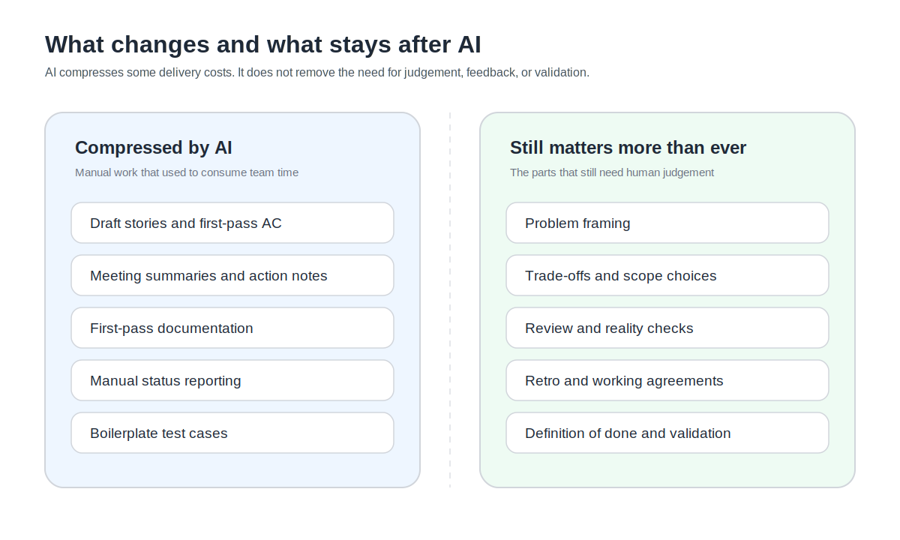

我原本真的有一陣子覺得，AI 這樣一路壓進來，Agile 大概也差不多了。

不是因為我突然討厭迭代。也不是因為我忽然想回去愛瀑布。比較像是，你會開始明顯感覺到，很多以前非得靠人手撐住的東西，現在一下子變便宜很多。故事草稿、會議整理、文件初稿、測試樣板，甚至有些需求拆法，現在都可以先讓 AI 幫你打一輪。站在那個時間點往回看，很難不懷疑，這整套 sprint、refinement、review，到底還剩多少是真的必要。

後來我慢慢發現，我原本看錯的地方，不在於 AI 會不會改變 Agile。它當然會。問題是，它先動到的不是我原本以為的那一層。

它先讓某些以前勉強還划算的中介動作，開始變得不太划算。

這個差別看起來很小，我現在反而覺得它很關鍵。因為如果你把 Agile 跟 Scrum 整團混在一起，很容易得出一個很爽的結論：AI 來了，流程可以丟了。這種話講起來很痛快，真的把團隊帶進現場，通常沒那麼簡單。

我現在反而比較相信另一種說法。AI 不是先把 Agile 沖掉，它比較像先把一些舊的成本結構沖鬆了。DORA 在 2025 年把 AI 描述成 amplifier，意思很直接，它放大的不是工具神話，而是組織原本的強弱。Digital.ai 同年的《State of Agile》也不是在寫 Agile 退場，而是在寫 adaptation，焦點還是 outcomes、value 和 adaptability。這兩份東西放在一起看，很像在提醒同一件事：變的不是我們還需不需要在不確定裡工作，變的是我們還需不需要沿用以前那種很重的方式，去承載同一件事。

如果把 Scrum 粗粗拆開，我現在會先分成三層看。

有一層比較像資訊同步。現在需求長怎樣，誰做了什麼，哪裡卡住，這個 story 邊界大概到哪裡。以前這一層很多事情真的只能靠人手整理，靠會議補齊。現在 AI 在這裡吃掉了一大塊成本，這很難假裝沒發生。

有一層比較像節奏與承諾。這一輪到底想解什麼，不解什麼，哪些先做，哪些晚點做，這次要扛哪些風險。這一層沒有消失，但它越來越不適合沿用那種大型、鈍重、像在人工搬運資訊的方式去跑。

還有一層，其實比較像風險控制。驗收標準清不清楚，什麼叫 done，這次 demo 到底有沒有真的把假設攤出來，retro 到底有沒有把問題留在流程層解，而不是留到下次再怪人。這一層我反而覺得在 AI 時代更重要。因為當生成成本下降、產出速度變快，爛東西也會更快長出來。模糊需求不會因為 AI 幫你寫得比較漂亮，就變得比較清楚。Scrum.org 這一年多對 AI 的態度，其實也滿接近這個方向。它不是說 Scrum 被推翻，而是一直把焦點拉回 empiricism，也就是 transparency、inspection、adaptation 這些比較像骨架的東西。

所以我現在越來越不把問題問成「AI 會不會取代 Agile」。

我比較常問的是，AI 把哪些成本打下來之後，我們還要不要繼續用原本那種方法去承載同一件事。前一個問題很適合吵立場。後一個問題比較像真的在工作。

例如 refinement。

我以前不太會特別討厭 refinement，因為那本來就是團隊一起把模糊需求拉到可做、可測、可驗收的地方。問題是，很多團隊後來把 refinement 跑成一種大型手工整理現場。大家花很多時間把故事打乾淨、把 acceptance criteria 補完整、把 ticket 排整齊。以前這樣做還算說得過去，因為那些東西本來就得有人生出來。現在 AI 可以先把第一版生出來之後，refinement 最值錢的部分反而變了。它不該再花那麼多力氣在「把內容做出來」，而是要把力氣花在「把邊界說清楚」。哪一刀先切，哪個假設先驗，什麼叫 done，哪裡有依賴，哪裡有風險。這些東西，AI 沒辦法替你承擔。Thoughtworks 今年提到的 spec-driven development，我覺得某種程度上就是同一個意思。不是要大家回去寫厚厚的規格，而是當 AI 對上下文、規格和約束更敏感時，真正值錢的不是把文件寫得更多，而是把邊界定得更準。

Daily standup 也是一樣。

我以前最受不了的，就是那種大家輪流報流水帳的 standup。每個人都很認真講昨天做了什麼、今天要做什麼，但空氣裡沒有一個人真的覺得這十分鐘有幫自己解決什麼。那種 standup 現在只會更尷尬。因為如果只是狀態更新，AI 能整理得比人快，也比人一致。人還坐在那裡，應該不是為了輪流唸昨天做了什麼。Daily 留下來的理由，應該是 unblock，是把原本會拖三天的問題當場撞出來，是讓風險提早浮上來。不是讓 Jira 看起來有被照顧。

我現在也不太相信「少開會」這種口號。坦白說，那種話有點便宜。比較麻煩的從來不是會議多不多，而是你到底有沒有把協作設計對。有些會議該死，是因為它們已經只剩儀式感。有些會議還該留，是因為它們其實是在替決策品質和風險控制付保費。

這件事我自己以前也看錯過。我原本比較討厭流程，尤其討厭那些看起來只是讓 backlog 更漂亮、讓 sprint 看起來更完整的流程。後來我才慢慢分得清楚，我討厭的不是流程本身，我討厭的是把流程當成果。好的 Agile，本來就不是把大家盯得更緊。它比較像是把管理從盯人，慢慢換成盯結果、盯學習、盯驗證。

Atlassian 2025 的 DevEx 研究對我來說也剛好補了這種現場感。它看到的不是「AI 一來，大家都省事了」，而是很奇妙的兩件事一起發生：很多團隊確實覺得 AI 幫自己省下時間，但組織內部的低效和摩擦並沒有跟著消失，甚至變得更明顯。這個結論其實很殘酷。它在說的不是 AI 沒用，而是 AI 先讓個人跑快了，接著把瓶頸往組織、資訊流、對齊品質那邊推。

所以如果今天有人問我，Agile 有沒有過時，我現在多半不會直接回答有或沒有。

我比較會先問，你說的 Agile，到底是那個在處理不確定性、靠短迭代和回饋修正方向的 Agile，還是那個後來被很多團隊跑成「一套很完整的 ceremony 行政學」的 Agile。如果是前者，我反而覺得它沒有過時。今天的產品和工程環境只會更需要它。如果是後者，那它不是現在才老，是現在比較明顯地老。

當然，這個判準也不是放諸四海皆準。

如果你帶的是高合規、高依賴、高跨部門成本的團隊，很多你現在很想嫌重的動作，本來就不是為了省時間，而是為了省事故。那些團隊的 planning、review、change control，本來就是治理的一部分。再來，如果一支團隊本來就沒有清楚的驗收、review 和 retro 習慣，AI 不會讓它突然變得更 agile，只會讓它更快地把模糊需求往下倒。這也是我現在越來越不信「AI 讓流程失去意義」這種話的原因。很多時候，AI 不是把壞流程變好，而是把壞流程跑得更快。

所以如果一定要把這篇壓成一句話，我現在比較願意這樣講：

不是 Agile 過時了。  
是有些交付做法開始顯得老了。

而且它們不是今天才老。只是以前沒那麼容易看出來。現在 AI 把速度變便宜之後，那些本來就只是在替舊成本結構服務的做法，終於比較藏不住了。

## Image Asset Plan

1. filename: agile-ai-01-what-changes-vs-what-stays.svg
   purpose: 對照 AI 壓縮掉的交付成本，和被 AI 放大重要性的敏捷骨架
   placement: 放在倒數第二段前後都可以，讓讀者在收尾前把判斷看清楚
   alt: What changes and what stays after AI
   prompt: 一張部落格友善的雙欄 SVG 圖，左側是 "Compressed by AI"，包含 draft stories, meeting summaries, first-pass documentation, manual status reporting；右側是 "Still matters more than ever"，包含 problem framing, review, retro, DoD, trade-offs, feedback loops。英文標籤，圓角方塊，現代、乾淨、柔和配色。
