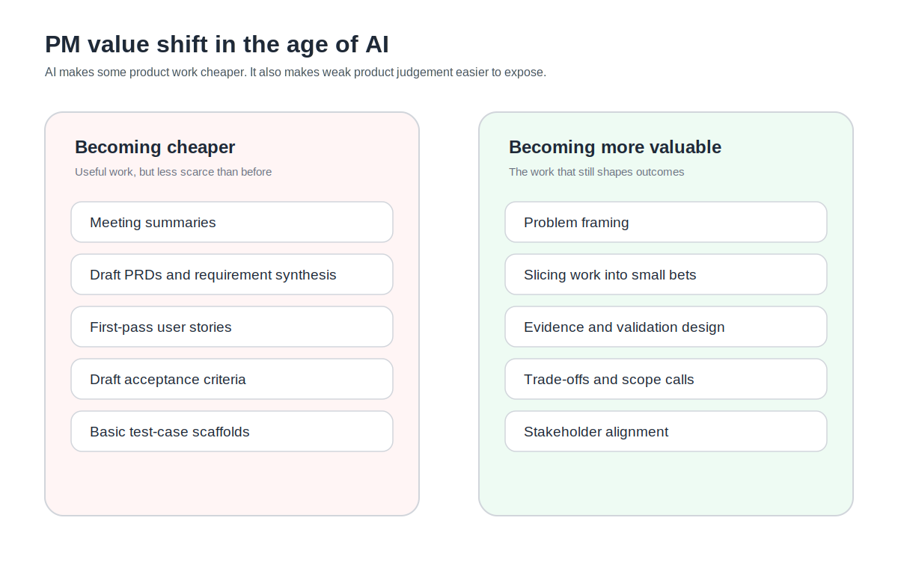
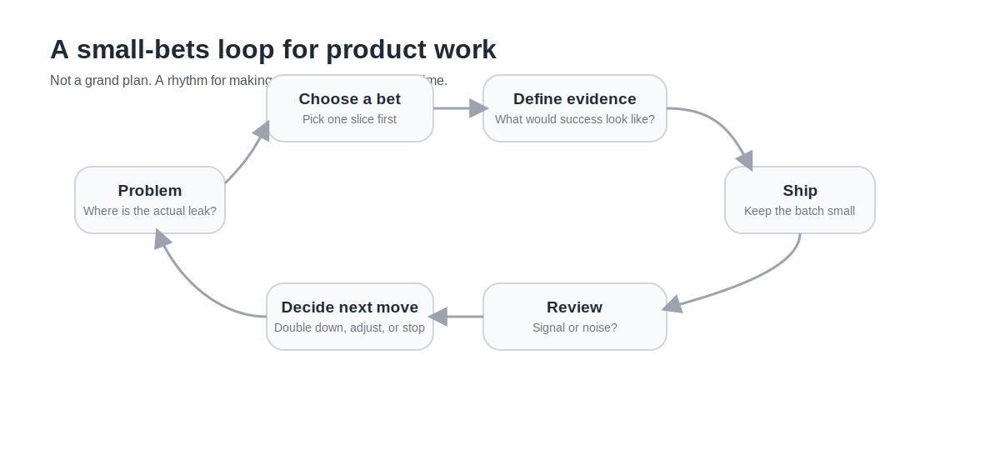

我現在越來越不喜歡「PM 會不會被 AI 取代」這種問題。

不是因為這題太大。是因為它太扁。它很容易把很多原本不同層次的工作，全都壓成同一團焦慮。最後你會得到一個很無聊的討論方向：哪些東西 AI 能做，哪些東西人類還做不到。這種切法通常不太好用，尤其如果你真的在做產品。

我比較在意的是另一件事。

AI 進來之後，哪些 PM 工作開始變便宜，哪些反而變得更值錢。

這個問題對我來說比較有用，因為它會逼你把角色拆開來看。很多以前很花時間、也很容易被誤認成核心能力的工作，現在確實在變便宜。會議整理、需求摘要、文件草稿、user story 第一版、acceptance criteria 初稿、測試案例草稿，甚至一些相對標準化的探索整理，AI 都可以先幫你打一輪。

這不是在說那些事情不重要。只是它們不再像以前那樣稀缺。

如果你今天還把一個 PM 的價值，很大一塊綁在「我很會把這些東西手工整理乾淨」，那個位置遲早會開始鬆。

但這不等於 PM 變小。

我反而覺得，PM 這個角色如果本來就站對位置，AI 進來之後只會更看得出哪些地方真的有差。Atlassian 的 2025 DevEx 研究就有一個我很喜歡的殘酷感。很多開發團隊覺得 AI 確實幫自己省下時間，但那些時間並沒有自動把組織摩擦一起帶走。意思其實很直接：便宜的是一部分搬運工作，不是判斷、對齊和取捨本身。

我現在比較願意把 PM 的核心拆成四塊。

| 能力 | AI 會壓縮掉什麼 | 人還必須負責什麼 |
| --- | --- | --- |
| Framing | 初步整理問題、資料彙整、需求重述 | 判斷現在到底該解哪個問題 |
| 切片 | 把功能草稿列出來、生成初版 story | 把大問題切成值得先驗的小賭局 |
| 驗證設計 | 產出測試草稿、整理指標候選 | 定義什麼算信號、什麼只是噪音 |
| Trade-off | 幫你把選項列滿、理由講得很順 | 決定先做什麼、先不做什麼，以及為什麼 |

第一塊是 framing。

不是接到需求之後把它翻成 ticket，而是先問清楚，我們到底在解哪一個問題。這個問題是不是現在最該解的。它和其他問題相比站在哪裡。這件事看起來有點抽象，實際上它很不抽象。因為團隊最後最浪費時間的地方，常常不是工程做得慢，而是從一開始就對錯問題投入了很高的執行力。

第二塊是切片。

我現在越來越不想把 backlog 管理講得太行政。真正有差別的不是誰把 backlog 排得很整齊，而是誰能把一個大而模糊的問題，切成足夠小、又真的能學到東西的賭局。不是每個 feature 都值得整包做完再看。很多時候，值錢的是先切出一刀，看哪個假設先被打臉，哪個假設值得繼續押。

第三塊是驗證設計。

我以前也很容易把「把需求寫清楚」跟「把問題定義清楚」混在一起。後來真的動手跑過幾輪，我才比較分得開。前者比較像整潔。後者才比較像方向。AI 很擅長幫你把整潔做得更漂亮，但方向還是要有人負責。什麼數據算信號，什麼只是噪音，這一輪做完到底學到了什麼，這些東西如果不先想，很多產出都只是看起來有進度。

第四塊是 trade-off。

這件事其實從來沒變過，只是 AI 讓它更不能假裝不重要。因為當做東西變快之後，團隊更容易出現一種錯覺：反正現在做起來很快，那就一起做吧。問題是產品工作裡最貴的東西從來不是「做出來」，而是「做對」和「不要亂做」。

我現在如果要看一個 PM 是不是開始站對位置，我不太會先看他 ticket 寫得多完整。我比較會看他怎麼切問題。

就拿一個很普通的例子來說好了。假設今天註冊完成率不理想。AI 可以很快幫你列出一串改善方向。一鍵登入、表單精簡、文案優化、錯誤訊息重寫、引導流程、社會認同模組，甚至連 stories 和 AC 都能先幫你生成。

真正有差別的不是誰列得比較多。

真正有差別的是，哪個 PM 會先問：我們掉在哪一步？這個掉點是摩擦、信任、動機，還是流程太長？一鍵登入看起來很合理，但它解的是不是當下最大的漏點？如果我只能先賭一刀，我要先賭哪一刀？賭對了會看到什麼信號？賭錯了又怎麼知道自己賭錯？

這些問題，才是產品工作裡真正貴的地方。

你前面整理過的那個一鍵登入例子，其實就很適合拿來看這件事。Impact 要不要打到 3，不是吵感覺，而是問：它是不是直接打中目前最大的漏點？Confidence 要不要壓低，不是因為悲觀，而是因為證據不夠。這種思考方式，比起把一個 feature 寫得很完整，更接近 PM 真正的價值。 所以我現在對「AI 會不會取代 PM」這種問題越來越沒耐心。

它常常把重點放在工具能不能做出某個動作，卻沒有問哪個動作本來就不該那麼值錢。與其問 PM 會不會被取代，我比較想問：哪一種 PM 會先開始顯得不值錢。

我的答案通常是這種。

很會搬運資訊。很會生文件。很會把 backlog 管得看起來很完整。很會把事情排得很漂亮。但不太能幫團隊切問題、做取捨、定義驗收和設計驗證的人。

這不是說 delivery hygiene 不重要。不是。只是它不該是整個角色最值錢的地方。

這個判準當然也有邊界。

如果你在一個高度成熟、流程穩定、對可預測交付要求很高的環境裡，delivery hygiene 本來就還是很值錢。那裡的好 PM，可能不是最會做小賭局的人，而是最能在穩定性、風險、跨部門協調和節奏之間做出低後遺症選擇的人。再來，有些 AI-native 團隊很容易高估自己的 discovery 能力，最後只是更快地把模糊問題包裝成 prototype。那不是 product sense，那比較像速度誤導。

我自己現在反而更想把 PM 想成一個很不 glamorous 的角色。

不是最會生答案的人。
是最會幫團隊少做錯事的人。

很多時候，這不是靠更厲害的會議，不是靠更漂亮的文件，也不是靠更大的 feature roadmap。比較像是你有沒有辦法站在問題前面，先把錯的路排掉，再把對的那條路切小，讓團隊可以用更低的成本去確認它。

AI 把很多工作變便宜，這是真的。

但它沒有把產品判斷變便宜。它只是把那些原本就不該那麼貴的事情，先打下來了。真正往上漲價的，反而是 framing、切片、驗證和 trade-off judgment。

