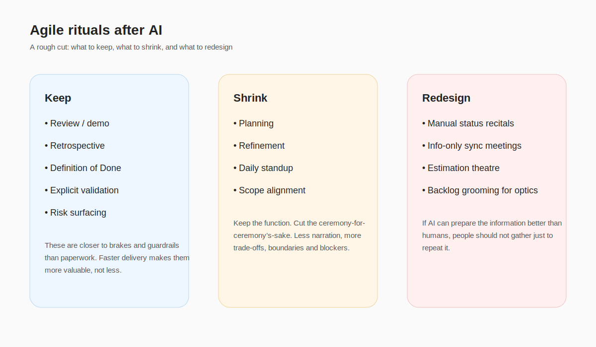
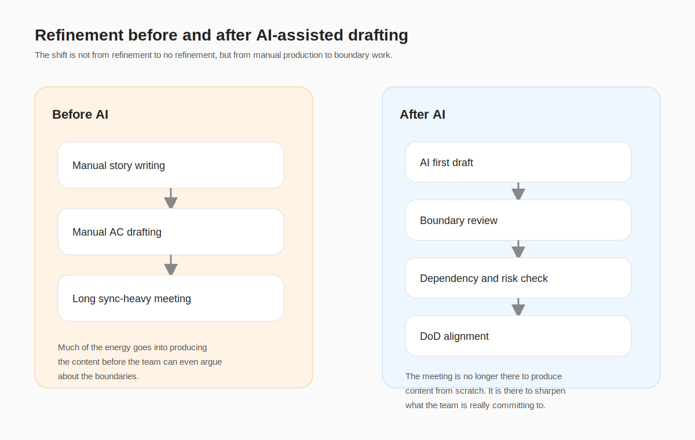

There was a point when I had very little patience for daily standups.

The bad version is easy to recognise. Everyone goes round saying what they did yesterday, what they’ll do today, and what’s blocked. The person speaking knows they’re reciting. The people listening know they’re not really listening. It carries just enough structure to feel legitimate, while doing very little actual coordination.

Looking back, the problem was never the ten minutes.

The problem was that a status recital had dressed itself up as collaboration.

I’ve also seen the other version. Much shorter. Barely a meeting, really. But it surfaces blockers, forces decisions, and stops a misunderstanding from drifting for two more days. That version still earns its keep.

That difference matters more to me now than the usual argument about whether AI will “kill Scrum”. I’m not that interested in the yes-or-no version of the question anymore. It turns into a belief system too quickly. One side wants to cut meetings on principle. The other protects the existing cadence on instinct.

The more useful question is duller and better:

What is this ritual actually doing for us now?

If a ceremony mainly exists to synchronise information, AI has probably eaten a meaningful chunk of its cost. If it exists to coordinate decisions, the format may change, but the function doesn’t disappear. If it exists to control quality and surface risk, I’m less willing than before to strip it out.

That’s roughly how I think about Scrum rituals now.

One bucket is information synchronisation. What does the story look like now? Which tickets are blocked? What changed? What’s missing? A lot of that used to require human effort simply because somebody had to assemble it. AI is very good at lowering the cost of first-pass assembly: meeting notes, story drafts, rough acceptance criteria, initial test cases. That does not make the ritual useless. It does make some old ways of running it look heavier than they used to.

Another bucket is decision coordination. Planning sits here for me, as do scope trade-offs and risk alignment. These rituals were never meant to be glorified data entry. Their job is to make a hard call: what are we committing to, what are we deliberately not committing to, and which risks are we willing to carry this round? AI can prepare the room. It cannot take accountability for that decision.

The last bucket is quality and risk control. Review. Retrospective. Definition of Done. These matter more to me now, not less. Once generation gets cheaper, “shipping something” gets cheaper too. What does not automatically get cheaper is shipping the right thing, or knowing whether a team is fooling itself. Scrum.org’s recent line on AI is actually quite close to this: AI may be rewiring Scrum Teams, but it is not invalidating Scrum’s empirical backbone. citeturn189000search3

That is why I’m not particularly persuaded by the generic “fewer meetings” line.

It sounds efficient, but it is a bit cheap. The harder problem has never been meeting volume by itself. It is whether coordination has been designed well in the first place. Some meetings deserve to die because nothing remains except ritual residue. Others are still worth paying for because they are effectively insurance premiums for decision quality and risk control.

Planning is a good example.

I don’t think planning should be removed in one dramatic stroke. What should go is the version of planning that feels like a large, slow information transfer exercise. Planning is not there to ensure everybody has work on their plate. It is there to sharpen the goal for the iteration, expose trade-offs, and clarify what will not be attempted. If AI lowers the cost of prep, planning should get shorter and harder at the same time: less narration, more commitment.

Refinement is probably where the shift is most obvious.

I was never especially anti-refinement, because in principle it is where a team takes something fuzzy and drags it towards being buildable, testable and reviewable. The problem is that a lot of teams turned refinement into a manual content production line. Write the story properly. Clean up the acceptance criteria. Organise the tickets. That used to be a defensible use of time because somebody genuinely had to generate the material. Once AI can produce the first draft cheaply, the most valuable part of refinement changes. It should spend less time producing content and more time defining boundaries. Which cut comes first? Which assumption deserves to be tested first? What counts as done? Where are the dependencies? Where does the risk actually sit? Thoughtworks’ recent attention to spec-driven development makes sense to me in that light. It is not a call to worship heavyweight documentation. It is a reminder that when AI becomes more sensitive to context, constraints and specification, precision becomes more valuable than volume. citeturn189000search2

The same is true of daily standups.

If the daily is still just a round of status updates, it becomes more awkward after AI, not less. If all you need is a clean state summary, a machine can produce that faster and more consistently than a room of humans can. If people are still there, the point should be to surface blockers, challenge assumptions, and force movement on something that would otherwise drift.

Review, retro and DoD are where I become much more conservative.

Once speed rises, these become the brakes. DORA’s framing of AI as an amplifier fits here as well. Strong systems get amplified. Weak systems do too. If your validation is vague, your data is fragmented, or your handoffs are sloppy, AI doesn’t repair that. It accelerates it. citeturn189000search0turn189000search4turn189000search12

A very ordinary product example makes this easier to see.

Take a registration flow optimisation project. In the old version, a team might spend a long refinement session manually shaping stories, acceptance criteria, edge cases, event tracking and messaging. In the newer, more sensible version, AI drafts the first pass. Product, design and engineering use refinement to challenge boundaries, decide which drop-off point matters first, and define what “done” actually means. Planning no longer exists to replay the paperwork. Daily is there to remove drag. Review is there to ask whether the funnel moved. Retro is there to ask whether the team’s way of slicing the work made the truth visible earlier, or merely pushed ambiguity downstream more quickly.

There are obvious limits to this view.

In heavily regulated organisations, or in large environments with expensive cross-functional dependencies, many rituals are not there for speed in the first place. They are there for governance, traceability and risk control. And for immature teams, stripping rituals too early rarely produces agility. More often it produces a mess with better branding. Atlassian’s 2025 developer experience research lands in roughly the same place: AI adoption is rising, but friction persists. Time saved by individuals gets eaten again by poor organisational coordination, fragmented knowledge and alignment debt. citeturn189000search2turn189000search10

So I’m less interested now in whether a team “uses Scrum”.

I’m more interested in whether each ritual still earns its keep. If it survives only as habit, it probably needs to shrink. If it still helps a team surface risk early, then cutting it simply because AI exists is usually the lazy answer.

AI does not really tell you to have fewer meetings.

It forces you to design better ones.

## Image Asset Plan

1. filename: agile-ai-rituals-01-keep-shrink-kill.svg
   purpose: Visualise which rituals to keep, shrink, or redesign
   placement: After the three-bucket analysis of ceremonies
   alt: Keep, shrink, or drop Agile rituals after AI
   prompt: A blog-friendly SVG with three columns: Keep, Shrink, Redesign. Include review, retro, DoD in Keep; planning, refinement, daily in Shrink; manual status recitals, information-only sync meetings, estimation theatre in Redesign. Clean modern style, rounded rectangles, soft colors, English labels.

2. filename: agile-ai-rituals-02-refinement-before-after.svg
   purpose: Compare refinement before and after AI-assisted drafting
   placement: After the refinement section
   alt: Refinement before and after AI-assisted drafting
   prompt: A side-by-side SVG diagram comparing refinement before and after AI-assisted drafting. Left side: manual story writing, manual AC drafting, long sync-heavy meeting. Right side: AI first draft, boundary review, dependency check, DoD alignment, risk discussion. Blog-friendly, minimal, English labels.
