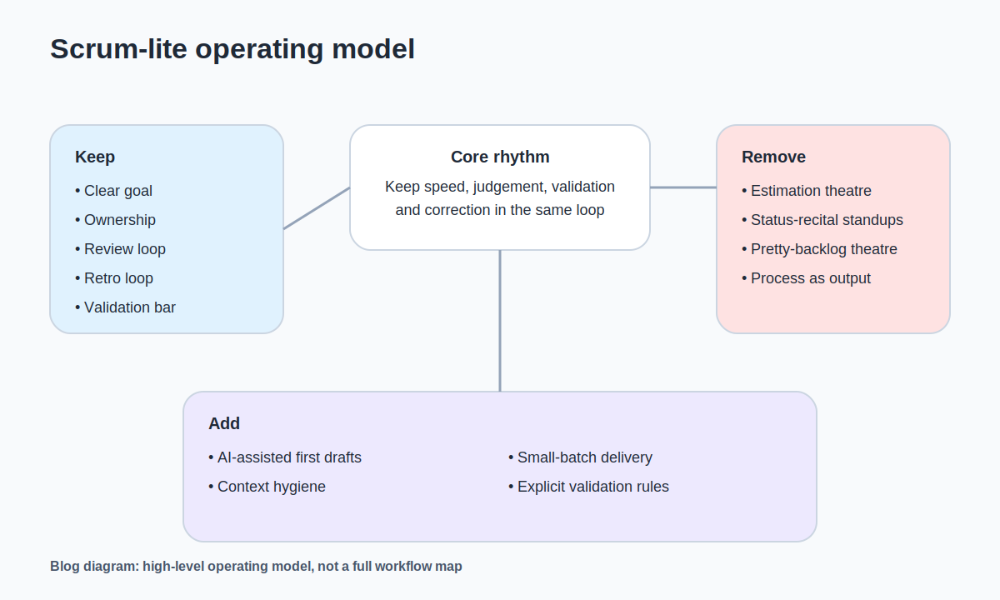

我看過兩種團隊。

一種流程很多，但學得不快。每個 ceremony 都有跑，票也整理得很漂亮，會議也開得很完整，可是真正要緊的誤會還是一路往後拖。大家不是沒做事，是做了很多看起來像在前進的事。

另一種剛好相反。什麼都喊快。少開會、少文件、少流程，聽起來很新，很輕，也很 AI 時代。結果只是更快地把模糊需求丟給工程，更快地把 prototype 當成答案，更快地把「先做再說」合理化。

這兩種我都不想要。

所以如果今天要我重新帶一支產品團隊，我不會照舊跑 Scrum。但我也不會把流程一把火燒掉。這不是折衷。比較像是，AI 把很多以前撐住協作成本的東西打便宜之後，你反而更有必要把工作節奏重新設計一次。

我現在對流程的偏好，比以前更保守，也更挑。

不是因為我突然變得很愛管理。剛好相反。是因為我越來越不相信 management theatre。那種看起來很完整、每個人都很忙、每週都有節奏、每張 Jira 都有被照顧的工作方式，最容易讓人誤以為團隊正在往前。真的可怕的不是混亂。真的可怕的是，一支團隊用非常有秩序的樣子，穩定地往錯的方向走。

AI 進來之後，這件事只會更明顯。

DORA 2025 把 AI 形容成 amplifier，我覺得很貼切。AI 不是自動把一支團隊變強，它比較像把原本已經存在的東西放大。你本來就清楚、節奏就乾淨、驗收就嚴，AI 會幫你跑更快。你本來就模糊、責任邊界不清、會議只是走流程，它也會幫你更快地把那些問題放大。Digital.ai 今年談 Agile，也不是在講退場，比較像在講 adaptation。這兩個東西放在一起看，我自己的感覺很簡單：AI 時代不是不需要流程，而是更不值得把時間浪費在錯的流程上。 

如果真的要說我現在會怎麼帶，我會保留五樣東西。

| 類別 | 我會保留 / 刪掉 / 補進來的東西 | 原因 |
| --- | --- | --- |
| 保留 | clear goal、ownership、review loop、retro loop、validation bar | 這些是在處理不確定性、責任與驗收 |
| 刪掉 | estimation theatre、status recital、pretty backlog theatre | 這些多半是在替舊成本結構服務 |
| 補進來 | AI first drafts、context hygiene、small-batch delivery、explicit validation rules | 這些才是 AI 時代更需要的新工作習慣 |

第一個是 clear goal。每一輪到底想解什麼問題，不想解什麼問題。這件事不能模糊。很多團隊不是沒有產出，是同一輪裡塞了太多彼此干擾的目標，最後每件事都做了一點，但沒有一件真的被解開。

第二個是 ownership。誰定義問題，誰判斷切法，誰拍板驗收，誰要對結果站出來。AI 讓職能邊界變得比較鬆，這沒錯。但責任邊界反而要更清楚。不然很容易變成所有人都碰到一點，每個人都以為自己有參與，最後沒有人真的對結果負責。

第三個是 review loop。不是等 sprint 結束才看，而是固定把東西攤出來看。重點不是 demo 本身，而是不要讓假設悄悄躲在進度裡。

第四個是 retro loop。不是情緒排毒，也不是每次都列一堆改善項。我的偏好比較簡單，每一輪只改一件真的會影響下一輪的規則。夠了。

第五個是 validation bar。你要叫它 DoD 也可以，不叫也沒關係。名字不是重點。重點是什麼叫 done，什麼叫其實還沒 done，什麼叫只是 code push 了但還不能算交付。生成成本越低，這條線越不能模糊。

我要砍掉的東西也很明確。

我不想再為了估點而估點。  
不想再為了 standup 而 standup。  
不想再為了 backlog 漂亮，把一堆其實還不 ready 的東西整理得很像 ready。  
也不想再把流程本身當成成果，最後整個團隊都很忙，卻沒有人比較早學到什麼。

這些東西以前不是完全沒道理。問題是成本結構變了，很多以前還說得過去的動作，現在越來越像習慣，不像必要。

我要補進來的，則是以前 Scrum 沒有明講、但現在非常需要的東西。

第一個是 AI-assisted first drafts。故事草稿、AC、測試案例、風險清單、研究摘要，這些東西都可以先讓 AI 打一輪。這不是因為它比較聰明，是因為它可以把一部分低價值搬運工作先清掉。

第二個是 context hygiene。我現在越來越不覺得規格這件事 old school。反而是 AI 時代，規格、上下文和邊界變得更值錢。Thoughtworks 今年在談 spec-driven development，我覺得抓到的其實就是這件事。不是文件越多越好，而是你給出去的上下文到底夠不夠乾淨，夠不夠能讓人和 AI 一起不走偏。

第三個是 small-batch delivery。以前很多團隊把功能綁成一包大的東西再一起上。現在很多假設其實可以拆得更小，甚至應該更小。因為 AI 把很多第一版做出來的成本打下來了，你更沒有理由把很多不確定綁在同一次賭局裡。

第四個是 explicit validation rules。這一點我現在反而比以前更保守。因為「先做出來再說」在 AI 時代變得太容易了。越容易做出來，越要先講清楚這一輪要看什麼訊號、誰能判斷這個結果算不算數、什麼情況下要停。

如果真的要把這套東西講得再具體一點，我大概會這樣跑。

一輪可以一週，也可以兩週，但不會太長。開始前先把這一輪的 goal 說清楚。refinement 盡量 async 前置，會上不重新打字，不重新念文件，主要討論邊界、依賴、風險和 done 的標準。planning 不做大型資訊搬運，而是做承諾與取捨。daily 要不很短，要不乾脆 async，重點是 blocker。中間就應該有小 review，不等到最後才一次攤開。結尾的 retro 只改一條規則，而且真的落地。

這套東西如果不放進具體 workflow，很容易像 founder memo。

所以我用一個最普通的例子。假設今天要優化註冊完成率。這一輪的 goal 不是「把登入做完整」，而是先把最大漏點打掉。AI 可以先把一鍵登入、錯誤訊息、欄位精簡、事件追蹤這些 stories 和 AC 初稿吐出來。產品、設計、工程在 refinement 裡要決定的，不是這些內容有沒有被生出來，而是哪一刀先切、先驗什麼、done 要長什麼樣。Daily 只處理 blocker。中間就看一次 demo，不等 sprint 結束才發現方向偏掉。最後 review 看的不是做了多少，而是漏斗有沒有真的動。retro 只問一件事：這一輪是哪些規則幫了我們，哪些規則還在浪費時間。

這也是我現在比較不相信「最好的流程」的原因。

我比較相信的是，一支團隊能不能把速度、判斷、驗證和修正，放進同一套節奏裡。AI 沒有替我們解決這件事。它只是讓這件事變得更不能逃。

這套東西當然也有失效的地方。

如果你帶的是大型、高合規、對稽核與可追溯要求很高的組織，這種 Scrum-lite 很可能需要更正式的治理殼。再來，Scrum-lite 也很容易退化成 chaos-lite。尤其當帶團隊的人不太會 framing 問題，也不太會守驗收邊界時，AI 只會讓模糊需求流動得更快。Atlassian 的 State of Teams 2025 提到，知識工作者和主管大概有四分之一的時間花在找答案。這種組織裡如果太快把節奏放鬆，通常不是自由，而是霧。

所以如果今天真的要我重帶一支產品團隊，我不會照舊跑 Scrum。

但我也不會天真地以為，把 Scrum 拿掉之後，剩下的東西自然就會比較聰明。

真正該重做的，不是 ceremony 清單。  
是整支團隊對速度、判斷、驗證和責任的安排方式。

